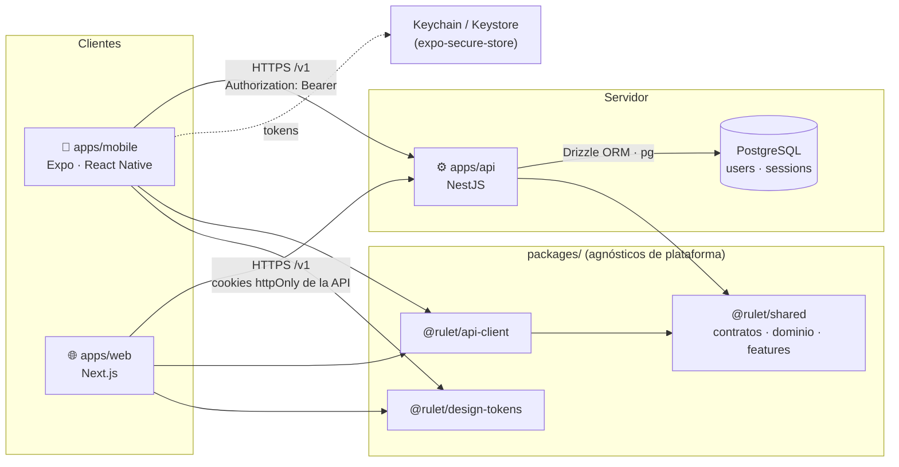
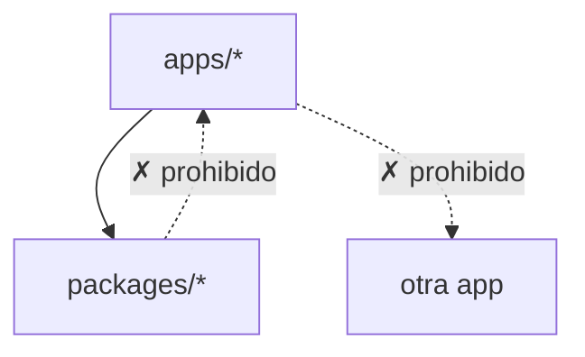
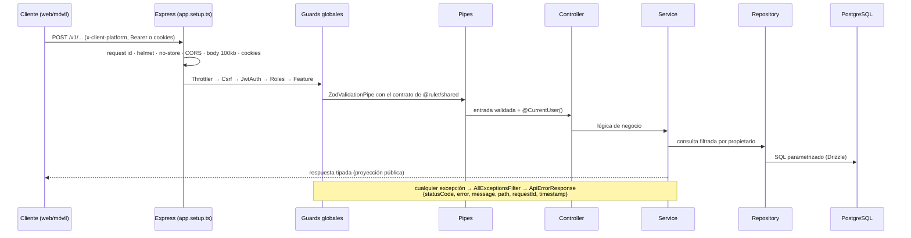

# Arquitectura

Rulet es un producto **mobile-first** con tres aplicaciones desplegables, una base de datos PostgreSQL y un
conjunto de paquetes compartidos, todo en un monorepo.

Este documento da la visión global. El detalle está en:

| Tema                                                       | Documento                                         |
| ---------------------------------------------------------- | ------------------------------------------------- |
| Orden de trabajo, capas y patrones obligatorios            | [Manual de desarrollo](./development-guide.md)    |
| Modelo de amenazas, autenticación, CSRF, CSP, secretos     | [Seguridad](./security.md)                        |
| Esquema, migraciones y consultas                           | [Base de datos](./database.md)                    |
| CI, publicación de imágenes, despliegue y ajustes del repo | [GitHub y despliegue](./github-and-deployment.md) |
| Variables de entorno de cada app                           | [Entornos y despliegue](./environments.md)        |
| Por qué cada decisión                                      | [ADR](./adr/README.md)                            |



## Piezas

| Pieza                                      | Responsabilidad                                                                                      | Se despliega en                  |
| ------------------------------------------ | ---------------------------------------------------------------------------------------------------- | -------------------------------- |
| `apps/mobile`                              | App principal iOS/Android. Guarda los tokens en el almacén seguro del sistema.                       | App Store / Play (EAS)           |
| `apps/web`                                 | Web pública y funcionalidades de escritorio. La sesión vive en cookies httpOnly emitidas por la API. | Contenedor o Vercel              |
| `apps/api`                                 | Única puerta a los datos. Autentica, autoriza por usuario y rol, y restringe por plataforma.         | Contenedor (migrador + réplicas) |
| PostgreSQL                                 | Usuarios (`users`) y sesiones de refresh token (`sessions`). Solo la API se conecta.                 | Servicio gestionado o propio     |
| `@rulet/shared`                            | Contratos HTTP (Zod), tipos de dominio (`ROLES`), catálogo `FEATURES`, constantes de transporte.     | — (librería)                     |
| `@rulet/api-client`                        | Cliente HTTP tipado: valida respuestas, gestiona tokens por plataforma y renueva la sesión.          | — (librería)                     |
| `@rulet/design-tokens`                     | Colores, espaciado, radios y tamaños de fuente. Valores puros que cada plataforma traduce.           | — (librería)                     |
| `@rulet/eslint-config` / `@rulet/tsconfig` | Configuración de calidad común y reglas de arquitectura y seguridad.                                 | — (tooling)                      |

## Reglas de dependencia

Estas reglas son lo que mantiene la arquitectura limpia con el tiempo. **Están automatizadas**: si se rompen, falla CI.



1. **Las apps dependen de los paquetes, nunca al revés**, y una app nunca importa de otra.
   → `turbo boundaries` (tags `app` / `lib` en cada `turbo.json`).
2. **`packages/*` es agnóstico de plataforma**: no importa `react`, `react-native`, `expo`, `next` ni `@nestjs/*`.
   → ESLint `no-restricted-imports` en `@rulet/eslint-config/library`.
3. **Solo se importa la API pública de un paquete** (`@rulet/shared`, nunca `@rulet/shared/src/...`).
   → ESLint en todas las configuraciones.
4. **Las apps cliente no contienen código de servidor** (`@nestjs/*` prohibido en web y móvil).

### Reglas de lint de seguridad

Se aplican igual que las de arquitectura (`pnpm lint`, `--max-warnings=0`). Detalle y excepciones en
[`packages/eslint-config/README.md`](../packages/eslint-config/README.md).

| Regla                                              | Dónde                         | Qué impide                                                                                            |
| -------------------------------------------------- | ----------------------------- | ----------------------------------------------------------------------------------------------------- |
| `no-restricted-properties` (`process.env`)         | todo el monorepo              | Leer configuración fuera de `**/config/env.ts`, `**/lib/env.ts`, `**/database/migrate.ts` y los tests |
| `no-restricted-syntax` (`dangerouslySetInnerHTML`) | web y móvil (`react`, `next`) | Insertar HTML sin escapar (XSS), también vía objetos de props                                         |
| `no-eval`, `no-implied-eval`, `no-new-func`        | todo el monorepo              | Ejecutar cadenas como código                                                                          |
| `no-script-url`                                    | todo el monorepo              | URLs `javascript:`                                                                                    |

## Contratos: una sola fuente de verdad

Cada endpoint tiene su esquema Zod en `packages/shared/src/contracts` (`auth.ts`, `users.ts`, `health.ts`,
`error.ts`). El mismo esquema:

- **en la API** valida la entrada (`ZodValidationPipe`) y tipa la salida;
- **en los clientes** tipa la llamada y valida la respuesta (`@rulet/api-client`).

Los esquemas de petición son `z.strictObject`: un campo desconocido es un `400`. Si alguien cambia un contrato,
TypeScript señala todos los puntos de API, web y móvil que hay que adaptar, en el mismo PR.

## Funcionalidades por plataforma

`packages/shared/src/features/index.ts` declara en qué plataforma existe cada funcionalidad:

```ts
export const FEATURES = {
  auth: ['web', 'mobile'],
  profile: ['web', 'mobile'],
  pushNotifications: ['mobile'],
  adminPanel: ['web'],
} as const satisfies Record<string, readonly Platform[]>;
```

- **Clientes**: `useFeature('adminPanel')` (`src/hooks/use-feature.ts`) para mostrar u ocultar UI.
- **API**: `@RequireFeature('adminPanel')` en un controlador rechaza con `403` las peticiones de plataformas sin
  esa funcionalidad. La plataforma llega en la cabecera `x-client-platform`, que añade `@rulet/api-client`.

> La cabecera de plataforma sirve para coherencia de producto, **no es un mecanismo de seguridad**: cualquiera puede
> enviarla. La autorización real se basa en la identidad (`@CurrentUser()`) y el rol (`@Roles()`).

El código propio de una plataforma vive en `apps/<plataforma>/src/features/<feature>`; lo común, en `packages/`.

## Autenticación

Autenticación propia en la API ([ADR 0008](./adr/0008-autenticacion-y-tokens.md)). Resumen; el detalle (cookies,
CSRF, rotación, detección de reutilización, límites) está en [Seguridad §2–§3](./security.md#2-comunicación-cliente--api).

| Aspecto          | Web (`x-client-platform: web`)                                                                                | Móvil (`x-client-platform: mobile`)                               |
| ---------------- | ------------------------------------------------------------------------------------------------------------- | ----------------------------------------------------------------- |
| Dónde viajan     | Cookies httpOnly de la API (`rulet_at` / `rulet_rt`, con prefijos `__Host-` / `__Secure-` si `COOKIE_SECURE`) | `tokens` en el cuerpo; `Authorization: Bearer` en cada petición   |
| Dónde se guardan | Solo en el navegador (cookies); el JavaScript de la página no los ve                                          | `expo-secure-store` (`apps/mobile/src/lib/secure-token-store.ts`) |
| `fetch`          | `credentials: 'include'`                                                                                      | `credentials: 'omit'`                                             |
| CSRF             | `SameSite` + `CsrfGuard` (comprueba `Origin` contra `CORS_ORIGINS`)                                           | No aplica (sin cookies)                                           |

- **Access token**: JWT HS256 firmado con `JWT_ACCESS_SECRET`, 15 min (`ACCESS_TOKEN_TTL_SECONDS`).
- **Refresh token**: opaco (32 bytes aleatorios), 30 días (`REFRESH_TOKEN_TTL_SECONDS`), se guarda solo su SHA-256
  en `sessions`, se **rota** en cada uso y, si se reutiliza uno ya rotado, se revoca toda la familia.
- **Contraseñas**: argon2id (`@node-rs/argon2`, `apps/api/src/modules/auth/password-hasher.ts`).
- **Seguro por defecto** ([ADR 0009](./adr/0009-seguro-por-defecto.md)): `JwtAuthGuard` es global; una ruta sin
  `@Public()` exige token.

## Base de datos

PostgreSQL con Drizzle ORM ([ADR 0007](./adr/0007-postgresql-drizzle.md)). El detalle está en
[Base de datos](./database.md).

- Esquema en `apps/api/src/database/schema/` (`users.ts`, `sessions.ts`, reexportados en `index.ts`).
- Migraciones SQL generadas por drizzle-kit en `apps/api/drizzle/` (`0000_init.sql`,
  `0001_session_family_expiry.sql`) y versionadas en git.
- `DatabaseModule` (global) expone la instancia Drizzle con el token `DATABASE`. **Solo los repositorios** la
  inyectan: Controller → Service → Repository.
- Migrar es un **paso del despliegue** separado del arranque: `node dist/database/migrate.js` (toma un
  `pg_advisory_lock` para que dos migradores no se pisen). La API nunca migra al arrancar.

## Anatomía de la API

```
apps/api/
├── src/
│   ├── main.ts                   Arranque (NestFactory + setupApp + listen)
│   ├── app.setup.ts              Middlewares de Express, CORS, versionado, logger (compartido con los e2e)
│   ├── app.module.ts             Composición: config, BD, throttler, módulos, filtro y guards globales
│   ├── config/                   env.ts (esquema Zod + reglas de producción) · AppConfigService · AppConfigModule
│   ├── common/
│   │   ├── auth/                 auth-cookies.ts: nombres, opciones y lectura estricta de las cookies de sesión
│   │   ├── decorators/           @Public() · @CurrentUser() · @Roles() · @ClientPlatform()
│   │   ├── guards/               CsrfGuard · JwtAuthGuard · RolesGuard · FeatureGuard (@RequireFeature)
│   │   ├── pipes/                ZodValidationPipe · RequiredPlatformPipe
│   │   ├── middleware/           requestIdMiddleware · bodyParserErrorHandler
│   │   └── filters/              AllExceptionsFilter → ApiErrorResponse
│   ├── database/                 database.module.ts · pool-config.ts · migrate.ts · schema/
│   └── modules/
│       ├── auth/                 controller · service · access-token.service · password-hasher · refresh-token
│       │                         · sessions.repository · account-throttler (@ThrottleByAccount)
│       ├── users/                controller (GET /v1/users/me) · service · repository
│       └── health/               controller (GET /health, GET /health/ready) · service · repository
├── drizzle/                      Migraciones SQL + meta/ (drizzle-kit)
└── test/                         e2e (supertest contra PostgreSQL real, BD *_test)
```

### Tubería de una petición

El orden es el del código: middlewares de Express en `apps/api/src/app.setup.ts` y guards globales (`APP_GUARD`) en
`apps/api/src/app.module.ts`. No hay interceptores globales.

| #   | Etapa                       | Pieza                                                                             | Si falla                                  |
| --- | --------------------------- | --------------------------------------------------------------------------------- | ----------------------------------------- |
| 1   | Id de petición              | `requestIdMiddleware` (reutiliza `x-request-id` seguro o genera un UUID)          | —                                         |
| 2   | Cabeceras de seguridad      | `helmet()`                                                                        | —                                         |
| 3   | Sin caché                   | `noStore` → `Cache-Control: no-store`                                             | —                                         |
| 4   | CORS                        | `enableCors` (lista blanca `CORS_ORIGINS`, `credentials: true`)                   | El navegador bloquea la respuesta         |
| 5   | Cuerpo                      | Parsers JSON y urlencoded, límite `100kb`                                         | —                                         |
| 6   | Errores del parser          | `bodyParserErrorHandler`                                                          | `400` / `413` / `415` `ApiErrorResponse`  |
| 7   | Cookies                     | `cookie-parser`                                                                   | —                                         |
| 8   | Rate limit                  | `ThrottlerGuard` (`default` por IP; `account` por email con `@ThrottleByAccount`) | `429`                                     |
| 9   | CSRF                        | `CsrfGuard` (métodos no seguros con cookie de auth: `Origin` ∈ `CORS_ORIGINS`)    | `403`                                     |
| 10  | Autenticación               | `JwtAuthGuard` (Bearer o cookie de access; salvo `@Public()`)                     | `401`                                     |
| 11  | Rol                         | `RolesGuard` (`@Roles(...)`)                                                      | `403`                                     |
| 12  | Plataforma                  | `FeatureGuard` (`@RequireFeature(...)`)                                           | `403`                                     |
| 13  | Validación                  | Pipes de parámetro: `ZodValidationPipe(<Schema>)`, `RequiredPlatformPipe`         | `400`                                     |
| 14  | Lógica                      | Controller → Service → Repository → PostgreSQL                                    | Excepción de Nest                         |
| —   | Cualquier excepción de Nest | `AllExceptionsFilter` (global, `APP_FILTER`)                                      | `ApiErrorResponse` (los 500 sin detalles) |

Antes de todo, `app.set('trust proxy', TRUST_PROXY)` fija de qué proxies se acepta `X-Forwarded-For`: de ello
depende `req.ip`, la clave del rate limiting por IP.



### Endpoints actuales

| Método y ruta            | Acceso                                       | Notas                                                         |
| ------------------------ | -------------------------------------------- | ------------------------------------------------------------- |
| `POST /v1/auth/register` | pública, 3/min por IP                        | `201`; `409` si el email ya existe. Exige `x-client-platform` |
| `POST /v1/auth/login`    | pública, 5/min por IP y 10/15 min por cuenta | `200`; `401` genérico con credenciales inválidas              |
| `POST /v1/auth/refresh`  | pública, 30/min por IP                       | Rota el refresh token                                         |
| `POST /v1/auth/logout`   | pública                                      | Siempre `204`; revoca la sesión y borra cookies               |
| `GET /v1/users/me`       | autenticada                                  | Perfil del usuario del token                                  |
| `GET /health`            | pública, sin rate limit                      | Liveness: no toca la BD                                       |
| `GET /health/ready`      | pública, sin rate limit                      | Readiness: `200`/`503` según `checks.database`                |

### Garantías de producción en la API

| Aspecto        | Cómo                                                                                                                                                                                           |
| -------------- | ---------------------------------------------------------------------------------------------------------------------------------------------------------------------------------------------- |
| Configuración  | Validada con Zod al arrancar (`src/config/env.ts`); con `NODE_ENV=production` exige `TRUST_PROXY`, `CORS_ORIGINS` https, `DATABASE_SSL` (o escape explícito) y rechaza secretos JWT de ejemplo |
| Errores        | Formato único `ApiErrorResponse`; los 500 no filtran detalles internos                                                                                                                         |
| Trazabilidad   | `x-request-id` en cada respuesta y en cada error, también en los del body parser                                                                                                               |
| Logs           | JSON estructurado en producción, legibles en desarrollo; en tests solo `warn`/`error`/`fatal`                                                                                                  |
| Seguridad HTTP | `helmet`, CORS por lista blanca con credenciales, `Cache-Control: no-store`, sin `x-powered-by`, cuerpo ≤ 100 kB                                                                               |
| Abuso          | Rate limiting global por IP y por cuenta en login (`@nestjs/throttler`, contadores en memoria)                                                                                                 |
| Versionado     | Rutas de dominio en `/v1/...` (versionado por URI); `/health` fuera del versionado                                                                                                             |
| Ciclo de vida  | Apagado ordenado (`enableShutdownHooks`); el pool de `pg` se cierra en `onApplicationShutdown`                                                                                                 |
| Despliegue     | Dos pasos con la misma imagen: migrar (`node dist/database/migrate.js`) y arrancar réplicas (`node dist/main.js`)                                                                              |
| Contenedor     | Multi-stage, base fijada por digest, solo deps de producción, código propiedad de root, usuario `node`, `HEALTHCHECK`                                                                          |

## Anatomía de los clientes

Web y móvil siguen la misma forma para que pasar de una a otra sea natural:

```
src/
├── app/          Rutas (expo-router / Next App Router). Finas: componen features.
├── features/     Una carpeta por funcionalidad de ESTA plataforma; su index.ts es la API pública
├── components/   UI reutilizable sin lógica de negocio
├── hooks/        Hooks transversales (useFeature…)
├── lib/          env validado, cliente API, utilidades
└── theme | styles  Traducción de @rulet/design-tokens a la plataforma
```

En ninguno de los dos la UI decide la autorización: ocultar una pantalla es experiencia de usuario; quien protege
los datos es la API.

### Web (`apps/web`)

```
apps/web/src/
├── proxy.ts                    Genera un nonce por petición y fija la Content-Security-Policy (Next 16: proxy, no middleware)
├── app/                        layout.tsx (await connection(): renderizado dinámico) · page · login · register · account · not-found
├── features/auth/              AuthProvider · LoginForm · RegisterForm · RequireAuth · AccountPanel · AuthNav · hooks · lib
├── components/                 Button · TextField · Card · Alert · SiteHeader (CSS Modules)
├── hooks/use-feature.ts
├── lib/
│   ├── env.ts                  NEXT_PUBLIC_API_URL validada (https en producción salvo loopback)
│   ├── api.ts                  createApiClient({ platform: 'web' }) + subscribeSessionExpired
│   ├── safe-redirect.ts        safeRedirectPath: solo rutas internas en ?next= (evita open redirect)
│   └── security/csp.ts         buildContentSecurityPolicy · createNonce (server-only)
└── styles/globals.css          Variables CSS desde @rulet/design-tokens
```

- Las cabeceras estáticas (HSTS, `X-Frame-Options`, `Permissions-Policy`, COOP, CORP…) están en `next.config.ts`; la
  CSP, que necesita nonce, en `src/proxy.ts`.
- Las cookies de sesión pertenecen al host de la API: el servidor de Next no las recibe, así que ni `proxy.ts` ni
  los Server Components hacen llamadas autenticadas.
- Web y API deben compartir _site_ (p. ej. `rulet.app` y `api.rulet.app`) para que se envíen las cookies `SameSite`.

### Móvil (`apps/mobile`)

```
apps/mobile/src/
├── app/
│   ├── _layout.tsx             AppProviders + Stack.Protected: (app) solo con sesión, (auth) solo sin ella
│   ├── (auth)/                 login · register
│   └── (app)/                  index (pantalla con sesión)
├── providers/                  AuthProvider / useSession: restaura y valida la sesión (users.me), login, logout
├── features/auth/              LoginForm · RegisterForm · SessionLoading · SignOutButton · hooks · validation · errors
├── components/                 Screen · Button · TextField
├── hooks/use-feature.ts
├── lib/
│   ├── env.ts / env-config.ts  Variante (extra.variant) y EXPO_PUBLIC_API_URL validadas
│   ├── api.ts                  createApiClient({ platform: 'mobile', tokenStore: secureTokenStore })
│   ├── secure-token-store.ts   TokenStore sobre expo-secure-store (WHEN_UNLOCKED_THIS_DEVICE_ONLY)
│   └── first-launch.ts · install-marker.ts   Borra la sesión heredada del Keychain tras reinstalar (iOS)
└── theme/                      Tokens de @rulet/design-tokens
```

Mientras la sesión se valida no se monta ninguna ruta (`SessionLoading`): nunca se ve una pantalla protegida sin
validar.

## Herramientas del monorepo

| Pieza                            | Para qué                                                                                                         | Detalle                                                                 |
| -------------------------------- | ---------------------------------------------------------------------------------------------------------------- | ----------------------------------------------------------------------- |
| `turbo/generators/` (`pnpm gen`) | Crear contrato, módulo de API, feature de cliente o funcionalidad completa con la arquitectura de este documento | [`turbo/generators/README.md`](../turbo/generators/README.md)           |
| `.github/workflows/`             | `ci.yml` (calidad, e2e con PostgreSQL, build y Trivy), `security.yml`, `release.yml`                             | [GitHub y despliegue](./github-and-deployment.md)                       |
| `docker-compose.yml`             | Entorno local "como en producción": `db` + `migrate` + `api` + `web`                                             | [Entornos y despliegue](./environments.md)                              |
| `.devcontainer/`                 | Codespaces / Dev Containers con Node 24 y PostgreSQL 17                                                          | [Manual de desarrollo §0](./development-guide.md#0-preparar-el-entorno) |
| `.husky/` + commitlint           | `pre-commit` (lint-staged) y `commit-msg` (Conventional Commits)                                                 | [Convenciones](./conventions.md)                                        |

## Lo que queda por decidir

Base de datos (PostgreSQL + Drizzle, [ADR 0007](./adr/0007-postgresql-drizzle.md)) y autenticación
([ADR 0008](./adr/0008-autenticacion-y-tokens.md)) ya están decididas. Quedan abiertas, y conviene registrarlas como
ADR antes de crecer:

- **Almacén compartido para el rate limiting** (p. ej. Redis): hoy los contadores están en memoria de cada proceso y
  con varias réplicas el límite efectivo se multiplica. Necesario antes de escalar en horizontal.
- **Email transaccional** (proveedor y plantillas): requisito para verificación de email y recuperación de
  contraseña, que no existen. Tampoco hay cambio de contraseña, "cerrar todas las sesiones" ni MFA.
- **Limpieza periódica de `sessions`**: falta decidir dónde corre el job (cron de la plataforma, `pg_cron`…); mientras
  tanto, SQL manual en [Base de datos §10](./database.md#10-limpieza-de-sesiones-caducadas).
- **Observabilidad**: errores (p. ej. Sentry), métricas y trazas (p. ej. OpenTelemetry), `report-to` para la CSP y
  eventos de auditoría.
- **Documentación OpenAPI** generada desde los contratos Zod.
- **Estado de servidor en clientes** (p. ej. TanStack Query).
- **Paginación**: no hay convención; los listados solo tienen un tope de filas.
- **Rotación de `JWT_ACCESS_SECRET` sin cortes** (convivencia de dos secretos, `kid`).
- **Tests de UI**: no hay tests de componentes ni e2e de navegador o dispositivo (p. ej. Playwright, Detox).

La lista completa de riesgos asumidos está en [Seguridad §9](./security.md#9-riesgos-residuales-y-trabajo-pendiente)
y las limitaciones del día a día en [Manual de desarrollo §8](./development-guide.md#8-limitaciones-conocidas).
