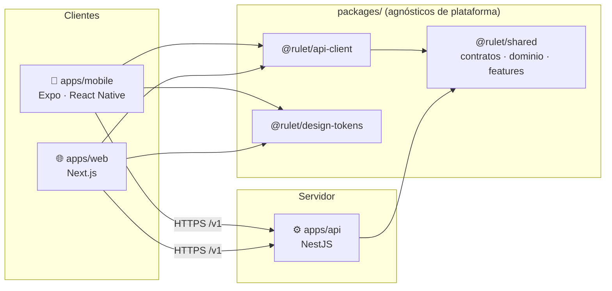
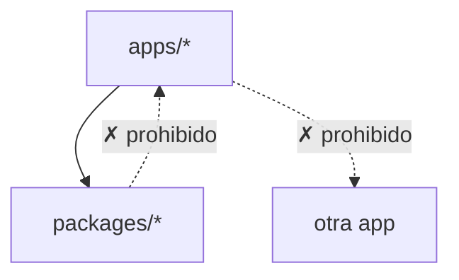
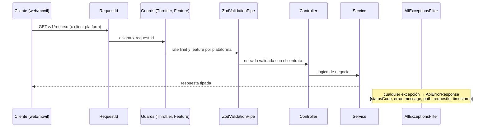

# Arquitectura

Rulet es un producto **mobile-first** con tres aplicaciones desplegables y un conjunto de paquetes compartidos, todo en un monorepo.



## Piezas

| Pieza                                      | Responsabilidad                                                                        | Se despliega en        |
| ------------------------------------------ | -------------------------------------------------------------------------------------- | ---------------------- |
| `apps/mobile`                              | App principal iOS/Android. Funcionalidades nativas (push, cámara…).                    | App Store / Play (EAS) |
| `apps/web`                                 | Web pública y funcionalidades de escritorio (p. ej. panel de administración).          | Contenedor o Vercel    |
| `apps/api`                                 | Única puerta a los datos y a la lógica de servidor. Autoriza por usuario y plataforma. | Contenedor             |
| `@rulet/shared`                            | Contratos HTTP (Zod), tipos de dominio, catálogo de features por plataforma.           | — (librería)           |
| `@rulet/api-client`                        | Cliente HTTP tipado que valida cada respuesta contra su contrato.                      | — (librería)           |
| `@rulet/design-tokens`                     | Colores, espaciado, tipografía. Valores puros que cada plataforma traduce.             | — (librería)           |
| `@rulet/eslint-config` / `@rulet/tsconfig` | Configuración de calidad común.                                                        | — (tooling)            |

## Reglas de dependencia

Estas reglas son lo que mantiene la arquitectura limpia con el tiempo. **Están automatizadas**: si se rompen, falla CI.



1. **Las apps dependen de los paquetes, nunca al revés**, y una app nunca importa de otra.
   → `turbo boundaries` (tags `app` / `lib` en cada `turbo.json`).
2. **`packages/*` es agnóstico de plataforma**: no importa `react`, `react-native`, `expo`, `next` ni `@nestjs/*`.
   → ESLint `no-restricted-imports` en `@rulet/eslint-config/library`.
3. **Solo se importa la API pública de un paquete** (`@rulet/shared`, nunca `@rulet/shared/src/...`).
   → ESLint en todas las configuraciones.
4. **Las apps cliente no contienen código de servidor** (`@nestjs/*` prohibido en web y móvil).

## Contratos: una sola fuente de verdad

Cada endpoint tiene su esquema Zod en `packages/shared/src/contracts`. El mismo esquema:

- **en la API** valida la entrada (`ZodValidationPipe`) y tipa la salida;
- **en los clientes** tipa la llamada y valida la respuesta (`@rulet/api-client`).

Si alguien cambia un contrato, TypeScript señala todos los puntos de API, web y móvil que hay que adaptar, en el mismo PR.

## Funcionalidades por plataforma

`packages/shared/src/features/index.ts` declara en qué plataforma existe cada funcionalidad:

```ts
export const FEATURES = {
  auth: ['web', 'mobile'],
  pushNotifications: ['mobile'],
  adminPanel: ['web'],
};
```

- **Clientes**: `useFeature('adminPanel')` para mostrar u ocultar UI.
- **API**: `@RequireFeature('adminPanel')` en un controlador rechaza con `403` las peticiones de plataformas sin esa funcionalidad. La plataforma llega en la cabecera `x-client-platform`, que añade `@rulet/api-client`.

> La cabecera de plataforma sirve para coherencia de producto, **no es un mecanismo de seguridad**: cualquiera puede enviarla. La autorización real se basa en la identidad y los permisos del usuario.

El código propio de una plataforma vive en `apps/<plataforma>/src/features/<feature>`; lo común, en `packages/`.

## Anatomía de la API

```
apps/api/src/
├── main.ts            Arranque
├── app.setup.ts       Configuración HTTP (compartida con los tests e2e)
├── app.module.ts      Composición de módulos y piezas globales
├── config/            Variables de entorno validadas + servicio tipado
├── common/            Piezas transversales
│   ├── filters/       AllExceptionsFilter → formato de error único
│   ├── guards/        FeatureGuard (@RequireFeature)
│   ├── pipes/         ZodValidationPipe
│   ├── middleware/    RequestIdMiddleware
│   └── decorators/    @ClientPlatform()
└── modules/<dominio>/ Un módulo Nest por dominio: controller, service, repository, specs
```

### Flujo de una petición



### Garantías de producción en la API

| Aspecto        | Cómo                                                                                |
| -------------- | ----------------------------------------------------------------------------------- |
| Configuración  | Validada con Zod al arrancar; si es inválida, el proceso no arranca                 |
| Errores        | Formato único `ApiErrorResponse`; los 500 no filtran detalles internos              |
| Trazabilidad   | `x-request-id` en cada respuesta y en cada error                                    |
| Logs           | JSON estructurado en producción, legibles en desarrollo                             |
| Seguridad HTTP | `helmet`, CORS por lista blanca, sin `x-powered-by`                                 |
| Abuso          | Rate limiting global (`@nestjs/throttler`)                                          |
| Versionado     | Rutas de dominio en `/v1/...`; `/health` fuera del versionado                       |
| Ciclo de vida  | Apagado ordenado (`enableShutdownHooks`) para despliegues sin cortes                |
| Contenedor     | Imagen multi-stage, solo deps de producción, usuario sin privilegios, `HEALTHCHECK` |

## Anatomía de los clientes

Web y móvil siguen la misma forma para que pasar de una a otra sea natural:

```
src/
├── app/          Rutas (expo-router / Next App Router). Finas: componen features.
├── features/     Una carpeta por funcionalidad de ESTA plataforma
├── components/   UI reutilizable sin lógica de negocio
├── hooks/        Hooks transversales (useFeature…)
├── lib/          env validado, cliente API, utilidades
└── theme | styles  Traducción de @rulet/design-tokens a la plataforma
```

## Lo que queda por decidir

Decisiones abiertas que conviene tomar (y registrar como ADR) antes de crecer:

- Base de datos y ORM (p. ej. PostgreSQL + Prisma o Drizzle).
- Autenticación (proveedor propio con JWT, o un servicio gestionado).
- Gestión de estado de servidor en clientes (p. ej. TanStack Query).
- Observabilidad: errores (Sentry) y métricas/trazas (OpenTelemetry).
- Documentación OpenAPI generada desde los contratos Zod.
