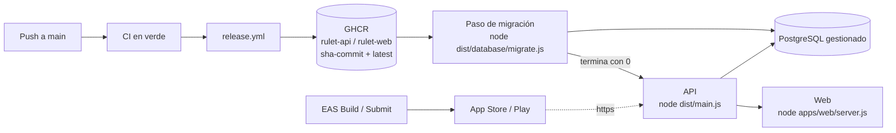

# GitHub y despliegue

**¿Se puede levantar este proyecto en GitHub, también la base de datos?** Para **desarrollar** y para **CI**, sí,
base de datos incluida. Para **producción**, no: GitHub no ofrece cómputo permanente ni bases de datos gestionadas,
así que la API, la web y PostgreSQL necesitan un proveedor externo. GitHub guarda el código, ejecuta CI y almacena
las imágenes que se despliegan.

| Pieza de GitHub               | ¿Sirve? | Para qué en Rulet                                                                                                                                   |
| ----------------------------- | ------- | --------------------------------------------------------------------------------------------------------------------------------------------------- |
| **Codespaces**                | Sí      | Entorno de desarrollo completo: Node 24, pnpm y PostgreSQL 17 con `rulet` y `rulet_test` (`.devcontainer/`). No es un entorno público ni permanente |
| **Actions**                   | Sí      | CI con un PostgreSQL temporal por ejecución (`ci.yml`), análisis de seguridad (`security.yml`) y publicación de imágenes (`release.yml`)            |
| **Container Registry (GHCR)** | Sí      | Guarda `ghcr.io/<owner>/rulet-api` y `ghcr.io/<owner>/rulet-web`, con SBOM y atestación de procedencia                                              |
| **Pages**                     | No      | Solo sirve archivos estáticos: no ejecuta la API, ni la web (CSP con nonce por petición), ni una BD                                                 |
| Producción                    | —       | Proveedor de cómputo para los contenedores + PostgreSQL gestionado + EAS para la app móvil                                                          |

Relacionado: [Entornos y despliegue](./environments.md) (variables y workflows), [Base de datos](./database.md)
(migraciones, roles, copias) y [Seguridad § 8b](./security.md#b-antes-de-la-primera-salida-a-producción)
(checklist antes de producción).

## Contenido

1. [Codespaces: entorno de desarrollo completo](#1-codespaces-entorno-de-desarrollo-completo)
2. [Actions: CI con PostgreSQL temporal](#2-actions-ci-con-postgresql-temporal)
3. [GHCR: imágenes publicadas](#3-ghcr-imágenes-publicadas)
4. [Por qué GitHub Pages no sirve](#4-por-qué-github-pages-no-sirve)
5. [Producción: qué hace falta](#5-producción-qué-hace-falta)
6. [Opciones de proveedor](#6-opciones-de-proveedor)
7. [Ruta recomendada, paso a paso](#7-ruta-recomendada-paso-a-paso)
8. [Ajustes manuales del repositorio en GitHub](#8-ajustes-manuales-del-repositorio-en-github)
9. [Verificar la procedencia de una imagen](#9-verificar-la-procedencia-de-una-imagen)
10. [Limitaciones y trabajo pendiente](#10-limitaciones-y-trabajo-pendiente)

## 1. Codespaces: entorno de desarrollo completo

`.devcontainer/devcontainer.json` define dos contenedores (`.devcontainer/docker-compose.yml`):

- `app`: `mcr.microsoft.com/devcontainers/typescript-node:4-24-bookworm` (Node 24), donde se trabaja.
- `db`: `postgres:17-alpine` con usuario `rulet`, contraseña `rulet` y la BD `rulet`; `init-test-db.sql` crea
  `rulet_test` la primera vez. Los datos viven en el volumen `devcontainer-db-data` mientras exista el codespace.

Ambos comparten red, así que la BD está en `localhost:5432` y los puertos 3000 (API), 3001 (web), 5432 y 8081
(Metro) se reenvían desde el mismo sitio. El codespace pide 4 CPU y 8 GB (`hostRequirements`).

### Abrirlo

1. En GitHub: **Code → Codespaces → Create codespace on main** (o `gh codespace create -R <owner>/rulet -b main`).
   En local sirve lo mismo con VS Code y la extensión _Dev Containers_: **Reopen in Container**.
2. Espera a que termine `postCreateCommand` (`.devcontainer/post-create.sh`), que:
   - activa pnpm (`sudo corepack enable pnpm`) e instala con `pnpm install --frozen-lockfile`;
   - copia `apps/api/.env.example` → `apps/api/.env`, `apps/web/.env.example` → `apps/web/.env.local` y
     `apps/mobile/.env.example` → `apps/mobile/.env` si no existen (nunca sobrescribe);
   - aplica las migraciones a `rulet` con `pnpm --filter @rulet/api db:migrate`;
   - termina con `Listo. Arranca todo con: pnpm dev`.

### Arrancar API, web y móvil

```bash
pnpm dev            # todo con Turborepo: API :3000, web :3001 y Metro (Expo)
pnpm dev:api        # solo la API (nest start --watch)
pnpm dev:web        # solo la web (Next)
pnpm dev:mobile     # solo Expo (expo start)
pnpm --filter @rulet/api test:e2e   # e2e contra rulet_test
```

El contenedor `app` define `DATABASE_URL`, `DATABASE_SSL=false`, `JWT_ACCESS_SECRET` (público, solo de
desarrollo) y `COOKIE_SECURE=false`. Con `pnpm dev:api` estas variables tienen prioridad sobre `apps/api/.env`;
con `pnpm dev` (Turborepo en modo estricto de variables) la API usa las de `apps/api/.env`, que en el Dev Container
tienen los mismos valores de conexión.

### Probar la web: solo por `localhost`

La web autentica con cookies `SameSite` emitidas por la API, que solo viajan si web y API están en el mismo _site_.
Las URLs públicas de Codespaces (`https://<nombre>-3001.app.github.dev`) son sites distintos entre sí y, además, el
bundle de la web llama a `NEXT_PUBLIC_API_URL=http://localhost:3000` (`apps/web/.env.local`), que en tu navegador es
tu propia máquina. Por eso el login **no funciona** desde el editor web de Codespaces. Dos formas que sí:

- abrir el codespace con **VS Code de escritorio** (los puertos se reenvían a `localhost`) y entrar en
  `http://localhost:3001`;
- desde tu máquina: `gh codespace ports forward 3000:3000 3001:3001 -c <nombre-del-codespace>` y abrir
  `http://localhost:3001`.

### Móvil

Metro escucha en el puerto 8081 del codespace. Lo más directo es ejecutar la app **en tu máquina**
(`pnpm dev:mobile` con el repo clonado en local) contra la API del codespace reenviada con
`gh codespace ports forward 3000:3000`: el simulador de iOS usa `http://localhost:3000` y el emulador de Android
`http://10.0.2.2:3000`, que son los valores por defecto de la variante `development` (`apps/mobile/src/lib/env-config.ts`).

Un dispositivo físico contra Metro dentro del codespace necesitaría `expo start --tunnel`, que depende de
`@expo/ngrok` (no está en el repo): no está soportado. **No hagas público el puerto 3000**: la API del Dev
Container firma tokens con un `JWT_ACCESS_SECRET` que está en git, así que cualquiera podría fabricar un access
token válido para ella.

### Si falta `rulet_test`

`init-test-db.sql` solo se ejecuta con el volumen vacío. Si el volumen se creó antes, crea la BD con cualquier
cliente de PostgreSQL conectado a `localhost:5432` como `rulet`: `CREATE DATABASE rulet_test OWNER rulet;`.

Un codespace se detiene por inactividad y se puede borrar: sirve para desarrollar, nunca como servidor.

## 2. Actions: CI con PostgreSQL temporal

| Workflow       | Cuándo                                                      | Qué hace                                                                                                                                                                                                             |
| -------------- | ----------------------------------------------------------- | -------------------------------------------------------------------------------------------------------------------------------------------------------------------------------------------------------------------- |
| `ci.yml`       | Cada PR y push a `main`                                     | Job `quality`: `pnpm format:check`, `pnpm boundaries`, `pnpm turbo run lint typecheck test build`, `db:migrate` y `test:e2e` contra el servicio `postgres`. Job `docker`: build de las imágenes de API y web y Trivy |
| `security.yml` | PR, push a `main`, lunes 04:23 UTC y manual                 | CodeQL, Dependency Review (solo PR), gitleaks y `pnpm audit --prod --audit-level=high`                                                                                                                               |
| `release.yml`  | Tras `CI` en verde de un **push** a `main` (`workflow_run`) | Publica las imágenes en GHCR ([§ 3](#3-ghcr-imágenes-publicadas))                                                                                                                                                    |

La BD de CI es un **servicio** del job `quality`: un contenedor `postgres:17-alpine` (usuario `rulet`, contraseña
`rulet_ci`, BD `rulet_test`) que nace y muere con cada ejecución. Las migraciones se aplican antes de los e2e con
`pnpm --filter @rulet/api db:migrate` y `NODE_ENV=test`. Las credenciales y el `JWT_ACCESS_SECRET` de `ci.yml` son
ficticios y públicos.

Ningún workflow **despliega**: publicar una imagen en GHCR no la pone en marcha en ningún sitio.

## 3. GHCR: imágenes publicadas

`release.yml`, por cada app (`api`, `web`):

1. Hace checkout del commit exacto que validó CI (`github.event.workflow_run.head_sha`).
2. Construye y sube **solo** `ghcr.io/<owner>/rulet-<app>:sha-<commit>` (SHA completo de 40 caracteres), con
   `provenance: mode=max` y `sbom: true`. `<owner>` va en minúsculas.
3. Escanea con Trivy **ese digest** (`CRITICAL,HIGH` con parche disponible).
4. Si pasa, firma una atestación de procedencia con Sigstore (`actions/attest-build-provenance`) y la sube al
   registro.
5. Mueve `latest` a ese mismo digest y comprueba que coincide.

Si Trivy falla, `sha-<commit>` queda publicado **sin atestación** y `latest` sigue en la versión anterior.

A tener en cuenta:

- La imagen de la **web** lleva incrustada `NEXT_PUBLIC_API_URL` (variable de repositorio
  `vars.NEXT_PUBLIC_API_URL`): sirve solo para la API de ese origen. Otro entorno (staging) necesita otra build.
- Los paquetes de GHCR son **privados** por defecto. Para que un proveedor los descargue, o los haces públicos, o le
  das credenciales de lectura: GitHub Packages se autentica con un _personal access token (classic)_ con el permiso
  `read:packages`, de una cuenta con acceso al paquete.
- La imagen de la API sirve para dos cosas: `node dist/database/migrate.js` (paso de migración) y el comando por
  defecto `node dist/main.js` (API).

## 4. Por qué GitHub Pages no sirve

GitHub Pages publica archivos estáticos ya generados. Ninguna pieza de producción de Rulet lo es:

- **API**: es un proceso Node (NestJS) que atiende peticiones, mantiene un pool de conexiones y emite cookies. Pages
  no ejecuta código de servidor.
- **Web**: `apps/web/src/proxy.ts` genera un **nonce distinto en cada petición** y lo pone en la cabecera
  `Content-Security-Policy`; Next lo inyecta en sus `<script>`. Eso exige un servidor Next (`output: 'standalone'`,
  `node apps/web/server.js` en la imagen) que renderice bajo demanda. Un export estático no tendría nonce ni
  cabeceras propias: habría que debilitar la CSP.
- **BD**: Pages no ofrece bases de datos.

## 5. Producción: qué hace falta



| Necesidad                     | Por qué                                                                                                          |
| ----------------------------- | ---------------------------------------------------------------------------------------------------------------- |
| Cómputo para contenedores     | API (puerto 3000) y web (puerto 3001) son procesos Node de larga duración                                        |
| Un paso previo de un solo uso | `node dist/database/migrate.js` antes de cada versión nueva de la API; la API nunca migra al arrancar            |
| PostgreSQL gestionado con TLS | En producción la API exige `DATABASE_SSL=true`; copias y PITR del proveedor                                      |
| Dominio propio con HTTPS      | Cookies `__Host-`/`__Secure-` (`Secure`) y web y API en el **mismo site** (p. ej. `rulet.app` y `api.rulet.app`) |
| Gestor de secretos            | `JWT_ACCESS_SECRET` y `DATABASE_URL` se inyectan como variables de entorno, nunca en la imagen                   |
| EAS                           | Builds firmadas de la app móvil y envío a tiendas                                                                |

**Mismo site**: las cookies de la API no llevan `Domain` y usan `SameSite` (`Lax` el access, `Strict` el refresh).
Los subdominios por defecto de muchos proveedores pertenecen a dominios de la _Public Suffix List_, en los que cada
subdominio es un site distinto: con la web en un subdominio así y la API en otro, el login web no funcionaría. Usa
un dominio propio para las dos.

## 6. Opciones de proveedor

Orientativo: no es una lista cerrada ni se ha probado ninguno con este repositorio. Comprueba precios, límites y
disponibilidad de cada función en la documentación del proveedor.

| Pieza      | Opción                               | Cómo encaja                                                                              | A tener en cuenta                                                                            |
| ---------- | ------------------------------------ | ---------------------------------------------------------------------------------------- | -------------------------------------------------------------------------------------------- |
| API        | **Render**                           | Servicio web desde una imagen de registro; comando previo al despliegue para migrar      | Credenciales de GHCR si el paquete es privado                                                |
| API        | **Railway**                          | Servicio desde imagen; comando previo al despliegue                                      | Ídem                                                                                         |
| API        | **Fly.io**                           | `fly deploy --image ghcr.io/…`; `release_command` en `fly.toml` para migrar              | Ídem                                                                                         |
| API        | **Google Cloud Run**                 | Servicio + **Cloud Run job** con `node dist/database/migrate.js`                         | Toma imágenes de Artifact Registry: hay que copiar o replicar la de GHCR                     |
| Web        | **Contenedor `rulet-web`**           | En el mismo proveedor que la API; sin variables de ejecución obligatorias                | Pasa por Trivy y atestación en `release.yml`                                                 |
| Web        | **Vercel**                           | Build desde el código: _Root Directory_ `apps/web`, `NEXT_PUBLIC_API_URL` en el proyecto | No usa la imagen de GHCR: esa build no pasa por Trivy ni se atesta                           |
| PostgreSQL | **Neon**, **Supabase**               | Postgres gestionado con TLS                                                              | Usa la conexión directa, no el pooler ([Base de datos § 7](./database.md#7-pool-y-timeouts)) |
| PostgreSQL | **Amazon RDS**, **Google Cloud SQL** | Postgres gestionado en la misma nube que el cómputo                                      | Suelen firmar con una CA propia ([Base de datos § 6](./database.md#6-conexión-y-tls))        |
| Móvil      | **EAS Build / Submit**               | Perfiles `development`, `preview`, `production` de `apps/mobile/eas.json`                | `EXPO_PUBLIC_API_URL` https por perfil                                                       |

Elige una versión mayor de PostgreSQL ≥ 13; la recomendada es **17**, la misma que en desarrollo y CI.

## 7. Ruta recomendada, paso a paso

Imagen de GHCR → migración → API → web, en un proveedor de contenedores con un Postgres gestionado. Ejemplo de
dominios: web en `https://rulet.app`, API en `https://api.rulet.app`.

### Paso 1 — Preparar GitHub

1. Crea la variable de repositorio `NEXT_PUBLIC_API_URL=https://api.rulet.app` (ver [§ 8](#8-ajustes-manuales-del-repositorio-en-github)).
   Sin ella, `release.yml` falla en el job de la web con `Falta la variable de repositorio NEXT_PUBLIC_API_URL`.
2. Fusiona en `main`. Cuando `CI` termine en verde, `Release` publica `rulet-api` y `rulet-web`.
3. Verifica la imagen y anota su digest ([§ 9](#9-verificar-la-procedencia-de-una-imagen)). Despliega siempre
   **por digest** (`ghcr.io/<owner>/rulet-api@sha256:…`), no por `latest`.

### Paso 2 — Crear la base de datos

1. Crea un PostgreSQL 17 gestionado, sin acceso público desde Internet si el proveedor lo permite (solo desde el
   cómputo), con copias automáticas activadas.
2. Crea los roles `rulet_owner` (migraciones) y `rulet_app` (API) y la BD `rulet`:
   [Base de datos § 8](./database.md#8-usuarios-de-bd-con-mínimo-privilegio).
3. Construye las dos URLs **sin** `sslmode` ni otros parámetros TLS (quita el `?sslmode=require` que suelen traer):
   `postgres://rulet_owner:<pass>@<host>:5432/rulet` y `postgres://rulet_app:<pass>@<host>:5432/rulet`.

### Paso 3 — Paso de migración

Un job o comando previo al despliegue con la **misma imagen** de la API:

| Campo   | Valor                                                                          |
| ------- | ------------------------------------------------------------------------------ |
| Imagen  | `ghcr.io/<owner>/rulet-api@sha256:<digest>`                                    |
| Comando | `node dist/database/migrate.js`                                                |
| Entorno | `NODE_ENV=production`, `DATABASE_URL` (rol `rulet_owner`), `DATABASE_SSL=true` |

Solo necesita esas variables (`validateDatabaseEnv()`). Debe terminar con código `0` antes de arrancar la API
nueva; si sale con `1`, el despliegue se detiene. Conexión directa a la BD, no a través de un pooler.

### Paso 4 — API

| Campo     | Valor                                                                                                                               |
| --------- | ----------------------------------------------------------------------------------------------------------------------------------- |
| Imagen    | La misma, comando por defecto (`node dist/main.js`)                                                                                 |
| Puerto    | `3000` (o el que el proveedor inyecte en `PORT`)                                                                                    |
| Liveness  | `GET /health` (no toca la BD)                                                                                                       |
| Readiness | `GET /health/ready` (`503` si la BD no responde en 2 s)                                                                             |
| Apagado   | `SIGTERM` y unos segundos de gracia (la API cierra el pool)                                                                         |
| Réplicas  | **1**: el rate limiting cuenta en memoria de cada proceso ([Seguridad § 9](./security.md#9-riesgos-residuales-y-trabajo-pendiente)) |

Variables (secretos en el gestor de secretos del proveedor):

| Variable            | Valor                                                                | Secreto |
| ------------------- | -------------------------------------------------------------------- | ------- |
| `NODE_ENV`          | `production`                                                         | No      |
| `DATABASE_URL`      | URL del rol `rulet_app`, sin `sslmode`                               | **Sí**  |
| `DATABASE_SSL`      | `true`                                                               | No      |
| `JWT_ACCESS_SECRET` | `openssl rand -base64 48`, uno distinto por entorno                  | **Sí**  |
| `CORS_ORIGINS`      | `https://rulet.app` (origen exacto de la web, sin barra final)       | No      |
| `TRUST_PROXY`       | Según la topología (tabla de abajo)                                  | No      |
| `APP_VERSION`       | Opcional: p. ej. el SHA del commit (nada lo inyecta; si no, `0.0.0`) | No      |
| `DATABASE_POOL_MAX` | Opcional (`10`): réplicas × valor < `max_connections`                | No      |

No definas `ALLOW_LOCALHOST_CORS` ni `DATABASE_SSL_ALLOW_INSECURE`, y deja `COOKIE_SECURE` sin definir (vale `true`
en producción). Referencia completa: [Entornos y despliegue](./environments.md#api-appsapienv).

**`TRUST_PROXY` según el proveedor.** Debe ser el número real de proxies que añaden `X-Forwarded-For` delante de la
API, o sus direcciones. Si confías en más saltos de los que hay, un cliente elige su IP y elude el rate limit; si en
menos, todos los clientes comparten la IP del proxy y se bloquean entre sí.

| Topología                                                     | Valor                                                  |
| ------------------------------------------------------------- | ------------------------------------------------------ |
| API expuesta directamente, sin proxy                          | `false`                                                |
| Un balanceador o proxy del proveedor (lo habitual en un PaaS) | `1`                                                    |
| CDN delante del balanceador del proveedor                     | `2`                                                    |
| Proxies con IPs conocidas (red privada, ingress)              | Lista de IP/CIDR, p. ej. `10.0.0.0/8`, o `uniquelocal` |

Confirma el número en la documentación del proveedor y compruébalo tras desplegar: enviando 6 logins en un minuto,
cada uno con un `X-Forwarded-For` falso distinto, el 6.º debe responder `429`.

### Paso 5 — Web

- **Contenedor**: `ghcr.io/<owner>/rulet-web@sha256:<digest>`, puerto `3001` (la imagen fija `PORT=3001` y
  `HOSTNAME=0.0.0.0`). No necesita variables en ejecución: `NEXT_PUBLIC_API_URL` ya va en el bundle. Cambiarla
  exige otra build.
- **Vercel** (alternativa): _Root Directory_ `apps/web` y `NEXT_PUBLIC_API_URL=https://api.rulet.app` en las
  variables del proyecto.

### Paso 6 — Dominios y TLS

1. `rulet.app` → web y `api.rulet.app` → API, con HTTPS en el borde y redirección de `http` a `https`.
2. Comprueba que `CORS_ORIGINS` coincide **exactamente** con el origen de la web y `NEXT_PUBLIC_API_URL` con el de
   la API (también se usa en `connect-src` de la CSP).

### Paso 7 — Comprobar

```bash
curl -fsS https://api.rulet.app/health          # {"status":"ok","version":…}
curl -fsS https://api.rulet.app/health/ready    # {"status":"ok","checks":{"database":"up"}}
```

Después, en `https://rulet.app`: registro, login, `/account` y logout. Y la prueba de `TRUST_PROXY` del paso 4.

### Paso 8 — Móvil

En EAS, `EXPO_PUBLIC_API_URL=https://api.rulet.app` para los perfiles `preview` y `production` (en `env` del perfil
de `apps/mobile/eas.json` o como variable de entorno de EAS). Sin ella, esas variantes fallan al arrancar a
propósito. Comandos: [Entornos y despliegue](./environments.md#móvil--eas).

### Siguientes despliegues

Siempre **migrar → API → web**, y cada migración compatible con la versión anterior de la API
([Base de datos § 4](./database.md#4-migraciones-sin-caída-expandcontract)). Antes de una migración arriesgada,
una copia ([Base de datos § 9](./database.md#9-copias-de-seguridad-y-restauración)).

## 8. Ajustes manuales del repositorio en GitHub

Los hace el propietario del repositorio en **Settings**; ningún archivo del repo puede activarlos.

### Protección de `main`

**Settings → Rules → Rulesets** (o **Branches → Branch protection rules**) para `main`:

- [ ] Exigir pull request antes de fusionar, con al menos una aprobación.
- [ ] **Require review from Code Owners** (`.github/CODEOWNERS` cubre auth, `common/`, contratos, BD y
      migraciones, `.github/`, Dockerfiles y `SECURITY.md`).
- [ ] Checks obligatorios (nombres de los jobs):

  | Workflow   | Check                                    |
  | ---------- | ---------------------------------------- |
  | `CI`       | `Lint · Typecheck · Test · Build`        |
  | `CI`       | `Docker (api)`, `Docker (web)`           |
  | `Security` | `CodeQL`                                 |
  | `Security` | `Revisión de dependencias`               |
  | `Security` | `Secretos (gitleaks)`                    |
  | `Security` | `Auditoría de dependencias (pnpm audit)` |

- [ ] Rama actualizada antes de fusionar, sin force push ni borrado de `main`.
- [ ] Fusión solo con squash (Settings → General → Pull Requests), como pide
      [Manual de desarrollo § 7](./development-guide.md#7-flujo-git).

**Code owners**: hoy todas las reglas de `CODEOWNERS` apuntan a un único usuario (`@jorgemen2011-lgtm`) y GitHub no
deja aprobar un PR propio. Con "Require review from Code Owners" activo, hace falta un segundo code owner o que el
administrador use el bypass de la regla.

### Seguridad

- [ ] **Private vulnerability reporting** (Settings → Code security): sin él, el enlace de
      [`SECURITY.md`](../SECURITY.md) no acepta informes.
- [ ] **Dependency graph** (lo necesita `actions/dependency-review-action`), **Dependabot alerts** y **security
      updates**.
- [ ] **Secret scanning** y **push protection**, si el plan lo permite.
- [ ] CodeQL ya se ejecuta desde `security.yml` (configuración avanzada): **no** actives también el _default setup_
      de code scanning.
- [ ] Settings → Actions → General: _Workflow permissions_ en "Read repository contents" (los workflows piden el
      resto por job).

### Variables, entornos y secretos de Actions

- [ ] **Variable** de repositorio `NEXT_PUBLIC_API_URL` (Settings → Secrets and variables → Actions → **Variables**)
      con el origen público de la API de producción. No es secreta: acaba en el bundle de la web.
- [ ] **Secretos**: ninguno. Los workflows solo usan el `GITHUB_TOKEN` automático. Los secretos de producción
      (`JWT_ACCESS_SECRET`, `DATABASE_URL`) viven en el proveedor, no en GitHub.
- [ ] **Entornos** (Settings → Environments): ningún workflow usa `environment:` hoy. Si se añade un workflow de
      despliegue, crea un entorno `production` restringido a `main` y con revisores obligatorios, y guarda en él
      (no en el repositorio) los secretos que necesite.

### Paquetes de GHCR

Tras la primera ejecución de `Release`, en el perfil del propietario → **Packages** → `rulet-api` / `rulet-web`:

- [ ] Comprueba que están vinculados al repositorio (los labels OCI de `docker/metadata-action` lo hacen).
- [ ] Decide la visibilidad: privados por defecto. Si siguen privados, crea para el proveedor un token (classic)
      con solo `read:packages`.

## 9. Verificar la procedencia de una imagen

Despliega solo imágenes con atestación verificada. Con `gh` autenticado (y `docker login ghcr.io` si el paquete es
privado):

```bash
OWNER=<owner>                       # en minúsculas
IMAGE=ghcr.io/$OWNER/rulet-api      # o rulet-web
COMMIT=<sha completo del commit>

# Digest de la imagen publicada para ese commit
DIGEST=$(docker buildx imagetools inspect "$IMAGE:sha-$COMMIT" --format '{{.Manifest.Digest}}')

# Atestación firmada por el workflow de release de este repositorio
gh attestation verify "oci://$IMAGE@$DIGEST" --owner "$OWNER" \
  --signer-workflow "$OWNER/rulet/.github/workflows/release.yml"

# SBOM y procedencia SLSA adjuntos por BuildKit
docker buildx imagetools inspect "$IMAGE@$DIGEST" --format '{{ json .SBOM }}'
docker buildx imagetools inspect "$IMAGE@$DIGEST" --format '{{ json .Provenance }}'
```

Un `sha-<commit>` sin atestación es una imagen que no pasó Trivy en `release.yml`: no la despliegues. Después,
referencia la imagen en el proveedor por `@$DIGEST`.

## 10. Limitaciones y trabajo pendiente

- No hay workflow de despliegue ni entorno de staging o previsualización por PR: desplegar es manual o de la
  integración del proveedor.
- `release.yml` produce **una** imagen web por valor de `NEXT_PUBLIC_API_URL`; otro entorno necesita otra build.
- `APP_VERSION` no se inyecta en ningún sitio: `/health` muestra `0.0.0` salvo que el despliegue la defina.
- Una sola réplica de la API mientras el throttler guarde los contadores en memoria.
- En Codespaces la web solo funciona por `localhost` (puertos reenviados) y la app móvil no puede usar un
  dispositivo físico contra Metro dentro del codespace.
- La app móvil no tiene actualizaciones OTA (`expo-updates` no está instalado): cada cambio requiere build nueva.
- No se ha probado ningún proveedor de la [§ 6](#6-opciones-de-proveedor) con este repositorio, ni la primera
  ejecución real de `release.yml`.
