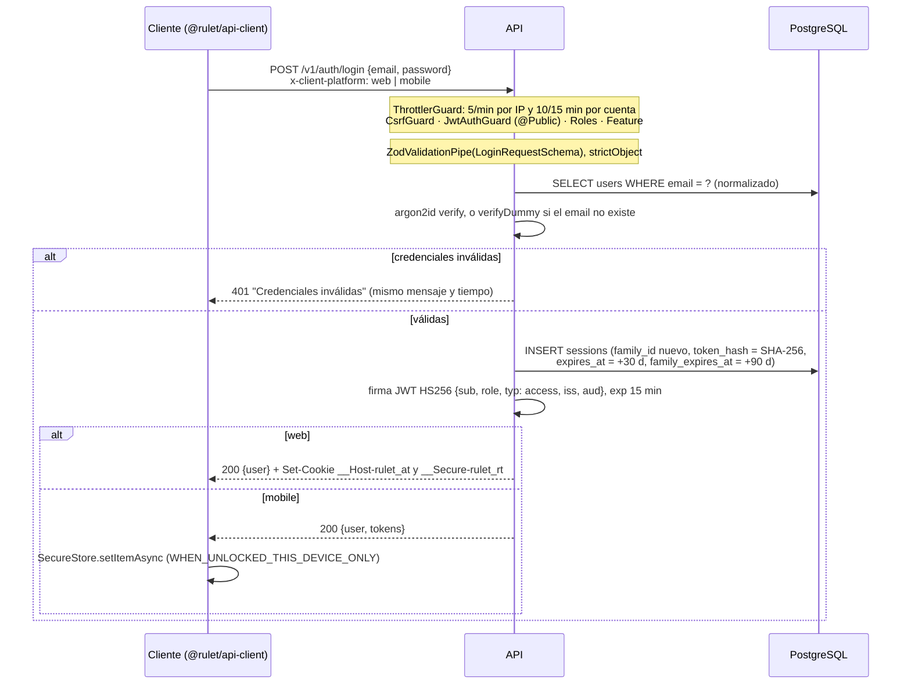
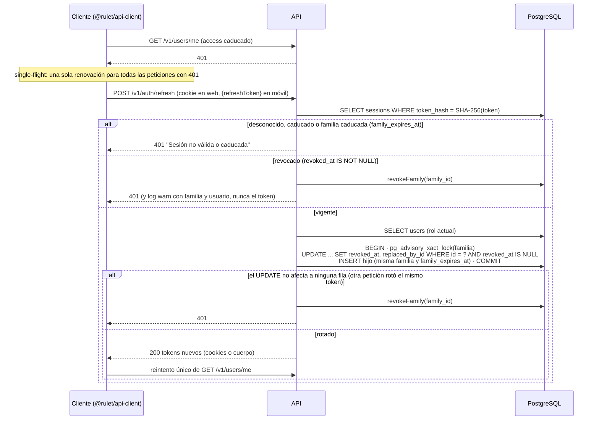
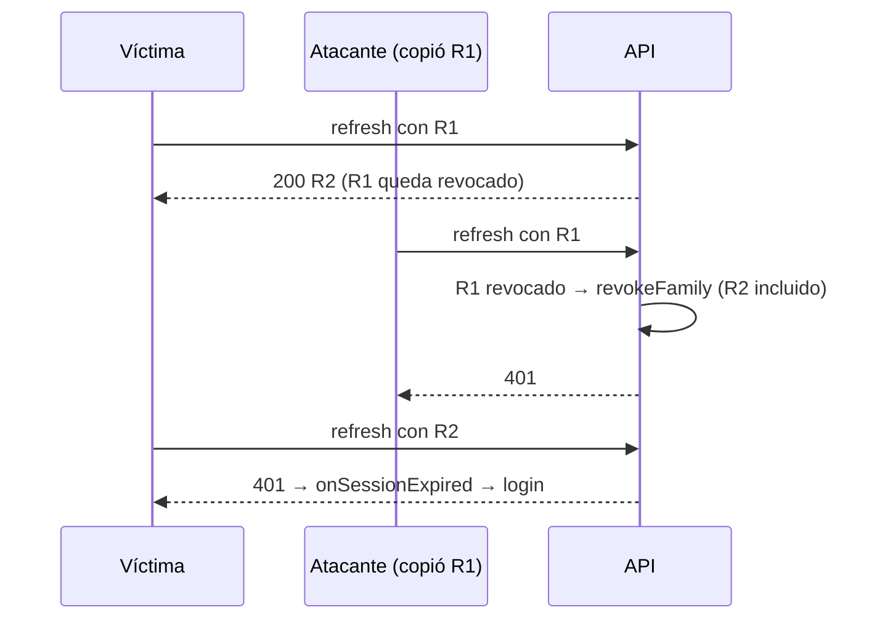

# Seguridad

Guía de seguridad de Rulet: qué protegemos, cómo está protegido hoy (con referencia al código) y qué reglas debe
seguir cada cambio. Es de obligado cumplimiento para todo PR.

- Cómo informar de una vulnerabilidad y qué versiones tienen soporte: [`SECURITY.md`](../SECURITY.md).
- Por qué la autenticación es como es: [ADR 0008](./adr/0008-autenticacion-y-tokens.md).
- Por qué todo es seguro por defecto: [ADR 0009](./adr/0009-seguro-por-defecto.md).
- Variables de entorno y despliegue: [Entornos y despliegue](./environments.md).

> Si cambias algo descrito aquí, actualiza este documento en el mismo PR. Si el código y este documento no
> coinciden, manda el código: abre un issue o corrige el documento.

## Contenido

1. [Modelo de amenazas](#1-modelo-de-amenazas)
2. [Comunicación cliente ↔ API](#2-comunicación-cliente--api)
3. [Backend (API)](#3-backend-api)
4. [Web](#4-web)
5. [Móvil](#5-móvil)
6. [Cadena de suministro y CI/CD](#6-cadena-de-suministro-y-cicd)
7. [Gestión de secretos](#7-gestión-de-secretos)
8. [Checklists](#8-checklists)
9. [Riesgos residuales y trabajo pendiente](#9-riesgos-residuales-y-trabajo-pendiente)

## 1. Modelo de amenazas

### Activos

| Activo                     | Dónde vive                                                                                                    | Si se compromete                                                          |
| -------------------------- | ------------------------------------------------------------------------------------------------------------- | ------------------------------------------------------------------------- |
| Contraseñas                | Solo su hash argon2id en `users.password_hash`                                                                | Acceso a la cuenta (y a otras webs si el usuario reutiliza la contraseña) |
| Refresh tokens             | Web: cookie `__Secure-rulet_rt`. Móvil: SecureStore. BD: solo su SHA-256 en `sessions.token_hash`             | Sesión de hasta 30 días renovable hasta la caducidad absoluta de 90 días  |
| Access tokens              | Web: cookie `__Host-rulet_at`. Móvil: SecureStore. No se guardan en el servidor                               | Actuar como el usuario durante un máximo de 15 min                        |
| `JWT_ACCESS_SECRET`        | Gestor de secretos de la plataforma (producción)                                                              | Firmar access tokens de **cualquier** usuario y rol, incluido `admin`     |
| Credenciales de la BD      | `DATABASE_URL` en el gestor de secretos                                                                       | Lectura y escritura de todos los datos                                    |
| Datos personales           | Tabla `users` (`email`, `name`)                                                                               | Fuga de datos personales                                                  |
| Imágenes y cadena de build | `ghcr.io/<owner>/rulet-api` y `rulet-web`, workflows de `.github/workflows`, dependencias de `pnpm-lock.yaml` | Código malicioso desplegado en producción                                 |

### Actores

| Actor                                                   | Qué intenta                                                                 |
| ------------------------------------------------------- | --------------------------------------------------------------------------- |
| Anónimo en Internet                                     | Credential stuffing, password spraying, enumerar cuentas, agotar recursos   |
| Usuario autenticado malicioso                           | Leer o modificar recursos ajenos (IDOR), asignarse un rol (mass assignment) |
| Sitio de terceros abierto en el navegador de la víctima | CSRF, clickjacking, open redirect tras el login                             |
| Atacante con un XSS en la web                           | Robar tokens o actuar en nombre del usuario                                 |
| Subdominio hermano bajo su control                      | Plantar cookies con el mismo nombre (cookie tossing)                        |
| Atacante en la red                                      | Interceptar o modificar tráfico (MITM)                                      |
| Quien tenga una copia de seguridad o reinstale la app   | Recuperar una sesión del dispositivo                                        |
| Dependencia o contribución maliciosa                    | Ejecutar código en CI, en las imágenes o en los clientes                    |

Fuera de alcance (ver [`SECURITY.md`](../SECURITY.md)): dispositivos con root/jailbreak, DoS volumétrico y
compromiso de la plataforma de hosting.

### Superficies

| Superficie | Entradas                                                                                                | Controles principales                                                                                                  |
| ---------- | ------------------------------------------------------------------------------------------------------- | ---------------------------------------------------------------------------------------------------------------------- |
| API        | `POST /v1/auth/{register,login,refresh,logout}`, `GET /v1/users/me`, `GET /health`, `GET /health/ready` | Guards globales, contratos Zod estrictos, rate limiting, CORS, CSRF, env validada ([§3](#3-backend-api))               |
| Web        | HTML servido por Next, parámetro `?next=` del login, cookies del host de la API                         | CSP con nonce, cabeceras estáticas, `safeRedirectPath`, sin tokens en JS ([§4](#4-web))                                |
| Móvil      | Almacén seguro, esquema de deep links `rulet` (`app.config.ts`), URL de la API                          | SecureStore, marca de primera ejecución, https obligatorio ([§5](#5-móvil))                                            |
| CI/CD      | PRs (también desde forks), dependencias, actions, imágenes base                                         | Permisos mínimos, actions por SHA, CodeQL, gitleaks, audit, Trivy, atestaciones ([§6](#6-cadena-de-suministro-y-cicd)) |

## 2. Comunicación cliente ↔ API

### TLS y HSTS

- **TLS termina en el balanceador o la plataforma**, no en el código. La API no redirige de http a https: eso lo
  hace el borde. Nunca expongas la API en http fuera de `localhost`.
- **HSTS**: la API lo envía con `helmet()` (`app.setup.ts`, valor por defecto de helmet 8:
  `max-age=31536000; includeSubDomains`). La web lo fija en `apps/web/next.config.ts`:
  `max-age=63072000; includeSubDomains; preload`. El navegador solo lo respeta si llega por https.
- **Los clientes rechazan http**:
  - `@rulet/api-client` (`packages/api-client/src/url.ts`, `resolveBaseUrl`) rechaza `http://` hacia hosts que no
    sean `localhost`, `127.0.0.1`, `[::1]` o `10.0.2.2`, salvo `allowInsecureHttp: true`, y rechaza URLs con
    credenciales (`user:pass@`).
  - Web (`apps/web/src/lib/env.ts`): `NEXT_PUBLIC_API_URL` debe ser `https://` en producción (solo se tolera
    loopback para builds locales y `docker compose`); sin credenciales, query ni fragmento.
  - Móvil (`apps/mobile/src/lib/env-config.ts` y `app.config.ts`): `EXPO_PUBLIC_API_URL` obligatoria y `https`
    en `preview` y `production`. `allowInsecureHttp` solo es `true` en `development`.
- **CSP de la web**: añade `upgrade-insecure-requests` en producción cuando la API es https (`src/proxy.ts`).
- **BD**: TLS con verificación del certificado ([§3 Base de datos](#base-de-datos)).

### CORS

Configurado en `apps/api/src/app.setup.ts`:

| Opción           | Valor                                                                                                                 |
| ---------------- | --------------------------------------------------------------------------------------------------------------------- |
| `origin`         | Lista exacta de `CORS_ORIGINS` (sin comodines; ver reglas de producción en [§3](#configuración-validada-al-arrancar)) |
| `credentials`    | `true` (la web envía cookies)                                                                                         |
| `methods`        | `GET`, `HEAD`, `POST`, `PUT`, `PATCH`, `DELETE`                                                                       |
| `allowedHeaders` | `content-type`, `authorization`, `x-client-platform`, `x-request-id`                                                  |
| `exposedHeaders` | `x-request-id`                                                                                                        |
| `maxAge`         | `600` s                                                                                                               |

CORS no autoriza nada: solo decide qué orígenes pueden **leer** respuestas desde el navegador. La autorización la
hacen los guards ([§3](#autorización-segura-por-defecto)).

### Cabecera de plataforma

Cada petición de `@rulet/api-client` lleva `x-client-platform: web | mobile` (`CLIENT_PLATFORM_HEADER` en
`packages/shared/src/platform.ts`). El llamante no puede sobrescribirla (`RESERVED_HEADERS` en `client.ts`).

- En `/v1/auth/*` es obligatoria (`RequiredPlatformPipe` → `400`) porque decide el transporte de los tokens.
- `FeatureGuard` la usa para `@RequireFeature`.
- **No es un control de seguridad**: cualquiera puede enviarla. Un cliente que diga `mobile` recibe los tokens en
  el cuerpo, pero son sus propias credenciales.
- Sí aporta defensa en profundidad: no es una cabecera _CORS-safelisted_, así que obliga al navegador a hacer
  preflight. Un formulario de otro sitio no puede enviarla (los endpoints de auth responden `400`) y un `fetch`
  de otro origen no pasa el preflight.
- Cada plataforma tiene **una sola fuente** del refresh token (`refreshTokenFrom` en `auth.controller.ts`): en web
  solo la cookie, en móvil solo el cuerpo. Un XSS en la web que envíe `x-client-platform: mobile` a `/refresh`
  no consigue nada: no conoce el refresh token, que vive en una cookie httpOnly.

### Transporte de tokens por plataforma

|                       | Web (`platform: 'web'`)                                           | Móvil (`platform: 'mobile'`)                              |
| --------------------- | ----------------------------------------------------------------- | --------------------------------------------------------- |
| Respuesta de auth     | `{ user }`; los tokens van en `Set-Cookie`, nunca en el cuerpo    | `{ user, tokens }`                                        |
| Dónde se guardan      | Cookies httpOnly del host de la API: el JS de la página no las ve | SecureStore (`apps/mobile/src/lib/secure-token-store.ts`) |
| Cómo viaja el access  | Cookie (`credentials: 'include'`)                                 | `Authorization: Bearer` (`credentials: 'omit'`)           |
| Cómo viaja el refresh | Cookie limitada a `/v1/auth`, cuerpo `{}`                         | Cuerpo `{ refreshToken }` en refresh y logout             |

Cookies (`apps/api/src/common/auth/auth-cookies.ts`, nombres en `packages/shared/src/auth-transport.ts`):

| Cookie  | `COOKIE_SECURE=true` | `COOKIE_SECURE=false` | Atributos                                                   |
| ------- | -------------------- | --------------------- | ----------------------------------------------------------- |
| Access  | `__Host-rulet_at`    | `rulet_at`            | `HttpOnly; SameSite=Lax; Path=/; Max-Age=900`               |
| Refresh | `__Secure-rulet_rt`  | `rulet_rt`            | `HttpOnly; SameSite=Strict; Path=/v1/auth; Max-Age=2592000` |

- `Secure` se añade cuando `COOKIE_SECURE=true`, que es el valor por defecto con `NODE_ENV=production`. Los
  prefijos `__Host-`/`__Secure-` hacen que el navegador rechace la cookie si no es `Secure` (y, en `__Host-`, si
  lleva `Domain` o un `Path` distinto de `/`).
- **Nunca llevan `Domain`**: quedan ligadas al host exacto de la API. Por eso el servidor de Next (otro host)
  nunca las recibe: ni `src/proxy.ts` ni los Server Components pueden llamar a rutas autenticadas.
- **Web y API deben estar en el mismo _site_** (p. ej. `rulet.app` y `api.rulet.app`); si no, el navegador no
  envía cookies `SameSite`. En Codespaces las URLs públicas `*.app.github.dev` son sites distintos (ver
  `.devcontainer/devcontainer.json`).
- **Cookie repetida = ausente**: si una cookie de auth llega más de una vez (un subdominio hermano puede plantar
  otra con `Domain=` del site padre), `readCookie` la ignora y el refresh responde `401`.
  `clearShadowedRefreshCookies` emite borrados para todas las variantes de `Path` y `Domain`, y el logout web
  revoca todos los candidatos recibidos (máximo 4, `MAX_REFRESH_COOKIE_CANDIDATES`).
- En `JwtAuthGuard`, si llega `Authorization` se usa solo esa cabecera: un Bearer inválido no cae a la cookie.

### CSRF

Tres capas, ninguna suficiente por sí sola:

1. **`SameSite`**: `Lax` en el access token (no viaja en peticiones cross-site salvo navegaciones GET de nivel
   superior) y `Strict` en el refresh.
2. **`CsrfGuard`** (`apps/api/src/common/guards/csrf.guard.ts`, global): en métodos que no sean `GET`, `HEAD` u
   `OPTIONS`, si la petición trae **cualquier** variante de cookie de auth (`hasAnyAuthCookie`), su `Origin` debe
   estar exactamente en `CORS_ORIGINS`. Sin `Origin`, con `Origin: null` o con otro origen → `403 Origen no
permitido`.
3. **Cabecera personalizada** `x-client-platform`, que fuerza preflight CORS (ver arriba). Protege también el
   _login CSRF_, donde aún no hay cookies y el `CsrfGuard` no actúa.

Regla: **una ruta `GET` nunca modifica estado**. La cookie de access viaja en navegaciones `GET` cross-site
(`Lax`) y `CsrfGuard` no comprueba los métodos seguros. Las peticiones móviles no llevan cookies y no les afecta.

### Versionado

- Rutas de dominio en `/v1/...` (`enableVersioning({ type: VersioningType.URI, defaultVersion: '1' })`);
  `/health` y `/health/ready` son `VERSION_NEUTRAL`.
- El cliente añade la versión (`version`, por defecto `v1`) y `assertSafePath` (`packages/api-client/src/url.ts`)
  rechaza rutas que podrían salir del prefijo o del origen: que no empiecen por `/`, que empiecen por `//`, con
  espacios, `#`, `\`, segmentos `.`/`..` o `%2e` codificado. Aun así, interpola datos externos en una ruta
  siempre con `encodeURIComponent`.

### Cliente HTTP: timeouts, redirecciones y renovación

`packages/api-client/src/http.ts` y `client.ts`:

- **Timeout** por intento de `DEFAULT_TIMEOUT_MS = 15_000`, que cubre también la lectura del cuerpo. Se puede
  cambiar con `timeoutMs` (cliente o petición).
- **Redirecciones rechazadas**: `fetch` se llama con `redirect: 'error'` (la API nunca redirige). React Native
  ignora esa opción y sigue la redirección; por eso además se comprueba `res.redirected` y se lanza
  `ApiError` con `code: 'invalid_response'`. Limitación: en React Native la petición redirigida ya ha llegado a su
  destino; solo se evita tratar su respuesta como si viniera de la API.
- **Respuestas validadas** contra el contrato de `@rulet/shared`; en móvil la respuesta de auth sin `tokens` se
  rechaza (`MobileAuthResponseSchema`).
- **Renovación reactiva**: ante un `401` en una ruta autenticada, una única renovación compartida (single-flight,
  imprescindible con la detección de reutilización) y un único reintento. Si la API rechaza la renovación
  (`401`/`403`), se limpia el `TokenStore` y se llama a `onSessionExpired`; los fallos transitorios (red, 5xx, 429) no cierran la sesión.
- **Cambio de identidad**: `identityEpoch` sube en login, register, logout y sesión expirada. Una petición emitida
  con otra identidad no se reintenta: se reenviaría autenticada como otro usuario. Detalle en
  `packages/api-client/README.md`.

### Login



### Refresh con rotación



### Detección de reutilización

Si un refresh token se copia, el primero que lo use obtiene un hijo y el token original queda revocado. Cuando el
otro lo presente, la API detecta la reutilización y revoca **toda la familia**: ambos pierden la sesión y el
usuario legítimo vuelve a autenticarse.



Contrapartida: si el atacante usa R1 **antes** que la víctima, obtiene R2 y la detección salta cuando la víctima
presenta R1. La familia se revoca igualmente, pero el atacante ha tenido acceso hasta ese momento.

## 3. Backend (API)

### Autenticación

| Pieza                     | Implementación                                                                                                                                                                                                                                                             |
| ------------------------- | -------------------------------------------------------------------------------------------------------------------------------------------------------------------------------------------------------------------------------------------------------------------------- |
| Contraseñas               | `PasswordSchema` (`packages/shared/src/contracts/auth.ts`): 12–128 caracteres, sin reglas de composición (NIST SP 800-63B). argon2id con `ARGON2_OPTIONS = { memoryCost: 19_456, timeCost: 2, parallelism: 1 }` (`password-hasher.ts`)                                     |
| Anti-enumeración en login | Si el email no existe se verifica contra un hash ficticio (`verifyDummy`): mismo tiempo y mismo `401 Credenciales inválidas`. Un hash corrupto nunca autentica                                                                                                             |
| Access token              | JWT HS256 de `ACCESS_TOKEN_TTL_SECONDS = 900` (15 min). Claims `sub`, `role`, `typ: 'access'`; `iss = JWT_ISSUER`, `aud = JWT_AUDIENCE`. Verificación con `algorithms: ['HS256']`, `iss` y `aud` (`auth.module.ts`) y claims validados con Zod (`access-token.service.ts`) |
| Refresh token             | Opaco: `randomBytes(32)` en base64url (`refresh-token.ts`). En BD solo `SHA-256` hex, `UNIQUE`. Validez `REFRESH_TOKEN_TTL_SECONDS` (30 días), nunca más allá de `family_expires_at`                                                                                       |
| Familia                   | Cada login crea una `family_id`; cada rotación hereda familia y `family_expires_at`                                                                                                                                                                                        |
| Caducidad absoluta        | `MAX_SESSION_LIFETIME_SECONDS` = 90 días desde el login (`auth.service.ts`), por mucho que se refresque                                                                                                                                                                    |
| Rotación                  | `SessionsRepository.rotate`: transacción con `pg_advisory_xact_lock(1384022117, hashtext(family_id))`, `UPDATE` condicional `revoked_at IS NULL` e `INSERT` del hijo. Si el `UPDATE` no afecta a ninguna fila → reutilización                                              |
| Revocación                | `revokeFamily` toma el mismo bloqueo, así que no se le escapa un hijo de una rotación en curso                                                                                                                                                                             |
| Rol actual                | `refresh` relee el usuario: el access nuevo lleva el rol vigente. Borrar un usuario borra sus sesiones (`ON DELETE CASCADE`)                                                                                                                                               |
| Logout                    | Revoca la familia del refresh recibido. Idempotente, siempre `204`, no exige access token. En web borra las cookies                                                                                                                                                        |

Los mensajes de error de auth son deliberadamente genéricos (`INVALID_CREDENTIALS`, `INVALID_SESSION`,
`REGISTRATION_FAILED` en `auth.service.ts`) y los clientes muestran textos fijos, nunca el del servidor
(`apps/web/src/features/auth/lib/auth-error-message.ts`, `apps/mobile/src/features/auth/errors.ts`).

### Autorización segura por defecto

Guards globales (`APP_GUARD` en `apps/api/src/app.module.ts`), **en este orden**:

| #   | Guard            | Qué comprueba                                                   | Falla con |
| --- | ---------------- | --------------------------------------------------------------- | --------- |
| 1   | `ThrottlerGuard` | Límites por IP (`default`) y por cuenta (`account`)             | `429`     |
| 2   | `CsrfGuard`      | `Origin` permitido si hay cookies de auth en métodos no seguros | `403`     |
| 3   | `JwtAuthGuard`   | Access token válido, salvo `@Public()`                          | `401`     |
| 4   | `RolesGuard`     | `@Roles(...)`; sin `req.user` deniega                           | `403`     |
| 5   | `FeatureGuard`   | `@RequireFeature(...)` según `x-client-platform`                | `403`     |

Decoradores (`apps/api/src/common/decorators/` y `guards/`):

| Decorador                                                     | Uso                                                                                     |
| ------------------------------------------------------------- | --------------------------------------------------------------------------------------- |
| `@Public()`                                                   | Única forma de abrir una ruta sin token. Hoy solo `AuthController` y `HealthController` |
| `@Roles('admin')`                                             | Restringe por rol (`ROLES = ['user', 'admin']`). Hoy no hay ninguna ruta con `@Roles`   |
| `@CurrentUser()`                                              | Inyecta `{ id, role }` del token; si no hay usuario responde `401`, nunca `undefined`   |
| `@RequireFeature('x')`                                        | Coherencia de producto por plataforma, no seguridad                                     |
| `@Throttle(...)` / `@ThrottleByAccount()` / `@SkipThrottle()` | Ajuste del rate limiting por ruta                                                       |

**IDOR: filtra siempre por propietario.**

- El id del usuario sale **siempre** de `@CurrentUser()`, nunca del cuerpo, la query o la ruta.
- El repositorio recibe el propietario y filtra por él en **cada** consulta; un recurso ajeno responde el mismo
  `404` que uno inexistente. Es el patrón que genera `pnpm gen` (`turbo/generators/templates/api-module/`):

```ts
// repository: el propietario forma parte del WHERE
.where(and(eq(items.id, id), eq(items.userId, userId)))

// service: mismo 404 si no existe o es de otro usuario
if (!row) throw new NotFoundException('Recurso no encontrado');
```

- Las respuestas se construyen con una **lista blanca** de campos (`toPublicUser` en `users.service.ts`): nunca se
  devuelve una fila tal cual (llevaría `password_hash`).

### Validación de entrada

- Todo cuerpo, query o parámetro se valida con `ZodValidationPipe` y el esquema de
  `packages/shared/src/contracts`, el mismo que usan los clientes. Los ids, con `ParseUUIDPipe`.
- Los esquemas de entrada son `z.strictObject`: un campo desconocido es `400`. Evita mass assignment (un
  `role: 'admin'` en `register` → `400`, probado en `apps/api/test/security.e2e-spec.ts`).
- Toda cadena lleva `max(...)`. El email se normaliza (`trim` + minúsculas) en el contrato.

### Rate limiting

`@nestjs/throttler` (`app.module.ts`, `auth.controller.ts`, `modules/auth/account-throttler.ts`):

| Ruta                       | Por IP (`default`)                                  | Por cuenta (`account`)            |
| -------------------------- | --------------------------------------------------- | --------------------------------- |
| Todas                      | `THROTTLE_LIMIT` por `THROTTLE_TTL_MS` (100 / 60 s) | —                                 |
| `POST /v1/auth/register`   | 3 / min                                             | —                                 |
| `POST /v1/auth/login`      | 5 / min                                             | 10 / 15 min por email normalizado |
| `POST /v1/auth/refresh`    | 30 / min                                            | —                                 |
| `/health`, `/health/ready` | Sin límite (`@SkipThrottle`)                        | —                                 |

- El límite por cuenta cuenta todos los intentos (exista o no el email) y responde el mismo `429` genérico, sin
  cabeceras propias.
- **`TRUST_PROXY`** decide de qué proxies se acepta `X-Forwarded-For` para calcular `req.ip`, la clave del límite
  por IP (`app.set('trust proxy', …)` en `app.setup.ts`, validada en `config/env.ts`):
  - `false`: tráfico directo, se ignora `X-Forwarded-For` (lo usa `docker-compose.yml`);
  - `1`–`10`: número de proxies delante de la API (`1` tras un único balanceador);
  - lista de IP/CIDR o `loopback`/`linklocal`/`uniquelocal`.

  Si confías en más saltos de los reales, cualquiera elige su IP y elude el límite; si confías en menos, todos los
  clientes comparten la IP del proxy. En producción es obligatoria.

- Los contadores están **en memoria de cada proceso** ([§9](#9-riesgos-residuales-y-trabajo-pendiente)).

### Errores sin fugas

- `AllExceptionsFilter` convierte toda excepción en `ApiErrorResponse` (`statusCode`, `error`, `message`,
  `details?`, `path`, `requestId`, `timestamp`). Un error no controlado responde `500 Error interno del servidor`.
- `bodyParserErrorHandler` da el mismo formato a los errores de Express previos a Nest (JSON mal formado, `413`).
- Lanza siempre excepciones HTTP de Nest con mensajes pensados para el cliente: su `message` sale tal cual.

### Logs sin secretos

- Logger JSON en producción (`ConsoleLogger({ json: config.isProduction })`).
- `describeError` registra solo `{ name, message }` y la traza; de un `DrizzleQueryError`, solo la consulta con
  marcadores `$n`, el código y el mensaje de `pg`, **nunca los parámetros** (emails, hashes).
- La reutilización de refresh token registra solo ids:
  `Reutilización de refresh token: familia <family_id> del usuario <user_id> revocada`.
- `x-request-id` entrante solo se reutiliza si cumple `^[\w.:-]{1,128}$` (evita inyectar saltos de línea en los
  logs); si no, se genera un UUID.
- Regla: **nunca** registres contraseñas, tokens, cookies, la cabecera `Authorization`, `req.body` ni
  `req.headers` completos.

### Cabeceras y límites HTTP

Todo en `apps/api/src/app.setup.ts`:

| Medida           | Valor                                                                       |
| ---------------- | --------------------------------------------------------------------------- |
| `helmet()`       | Valores por defecto de helmet 8 (HSTS, `nosniff`, `X-Frame-Options`, CSP…)  |
| `x-powered-by`   | Desactivado                                                                 |
| `Cache-Control`  | `no-store` en todas las respuestas (middleware `noStore`)                   |
| Límite de cuerpo | `100kb` en JSON y urlencoded (`BODY_LIMIT`) → `413`                         |
| `x-request-id`   | En cada respuesta y en cada error                                           |
| Apagado          | `enableShutdownHooks()`; el pool de BD se cierra en `onApplicationShutdown` |

Si una ruta debe ser cacheable, lo declara explícitamente con `@Header('Cache-Control', …)` y solo si no
devuelve datos de usuario.

### Configuración validada al arrancar

`apps/api/src/config/env.ts` (`validateEnv`) se ejecuta al arrancar: si algo falla, **la API no arranca**. Los
booleanos solo aceptan `true`/`false`/`1`/`0` (`z.coerce.boolean()` convertiría `'false'` en `true`).

| Variable            | Regla siempre                                                                                                                                                                   | Regla adicional en `NODE_ENV=production`                                                                                                      |
| ------------------- | ------------------------------------------------------------------------------------------------------------------------------------------------------------------------------- | --------------------------------------------------------------------------------------------------------------------------------------------- |
| `JWT_ACCESS_SECRET` | Obligatoria, ≥ 32 caracteres                                                                                                                                                    | Rechazada si contiene `insecure`, `not-a-secret`, `dev-only`, `devcontainer`, `test-only`, `cambia-esto` o `change-me` (`DEV_SECRET_MARKERS`) |
| `CORS_ORIGINS`      | Orígenes exactos `esquema://host[:puerto]`; por defecto `http://localhost:3001`                                                                                                 | Obligatoria; solo `https://`; sin `localhost` salvo `ALLOW_LOCALHOST_CORS=true`                                                               |
| `TRUST_PROXY`       | `false`, `1`–`10` o lista de IP/CIDR; por defecto `loopback`                                                                                                                    | Obligatoria, sin valor por defecto                                                                                                            |
| `DATABASE_SSL`      | Booleano estricto                                                                                                                                                               | Debe ser `true` salvo `DATABASE_SSL_ALLOW_INSECURE=true`                                                                                      |
| `DATABASE_URL`      | `postgres://`; se rechazan `ssl`, `sslnegotiation`, `uselibpqcompat`, cualquier `sslmode` distinto de `verify-full`, y `sslrootcert`/`sslcert`/`sslkey` sin `DATABASE_SSL=true` | —                                                                                                                                             |
| `COOKIE_SECURE`     | Booleano estricto                                                                                                                                                               | Por defecto `true`                                                                                                                            |

`ALLOW_LOCALHOST_CORS` y `DATABASE_SSL_ALLOW_INSECURE` son escapes **solo** para `docker compose` local; nunca en
un despliegue real. El migrador (`src/database/migrate.ts`) valida solo las variables de BD con las mismas reglas
(`validateDatabaseEnv`).

ESLint (`packages/eslint-config/base.js`) prohíbe leer `process.env` fuera de `config/env.ts`, `lib/env.ts`, el
migrador y los tests: el resto del código recibe la configuración ya validada (`AppConfigService`).

### Base de datos

- **TLS verificado**: con `DATABASE_SSL=true`, `ssl: { rejectUnauthorized: true }` (`database/pool-config.ts`). Con
  una CA privada: `DATABASE_SSL=true` y `?sslmode=verify-full&sslrootcert=/ruta/ca.pem` en la URL.
- **Timeouts**: `connectionTimeoutMillis: 5_000`, `statement_timeout: 15_000`, `idleTimeoutMillis: 30_000`.
- **Consultas parametrizadas**: usa el query builder de Drizzle o la plantilla `` sql`…${valor}…` ``, que envía los
  valores como parámetros. **Prohibido** `sql.raw()` o concatenar cadenas con datos externos.
- **Acceso solo desde repositorios** (Controller → Service → Repository); el token `DATABASE` es global, pero solo
  los repositorios lo inyectan.
- **Migraciones** como paso separado (`node dist/database/migrate.js`), nunca al arrancar, serializadas con
  `pg_advisory_lock`.
- **Mínimo privilegio**: el código no lo impone; es responsabilidad del despliegue. Usa dos roles: uno propietario
  del esquema para el migrador y otro solo con DML para la API (el paso de migración recibe su propia
  `DATABASE_URL`). Ejemplo, ejecutado como propietario tras migrar:

  ```sql
  CREATE ROLE rulet_app LOGIN PASSWORD '<generada>';
  GRANT CONNECT ON DATABASE rulet TO rulet_app;
  GRANT USAGE ON SCHEMA public TO rulet_app;
  GRANT SELECT, INSERT, UPDATE, DELETE ON ALL TABLES IN SCHEMA public TO rulet_app;
  ALTER DEFAULT PRIVILEGES IN SCHEMA public GRANT SELECT, INSERT, UPDATE, DELETE ON TABLES TO rulet_app;
  ```

  `ALTER DEFAULT PRIVILEGES` debe ejecutarlo el mismo rol que crea las tablas en las migraciones. Las tablas del
  migrador de Drizzle están en el esquema `drizzle`, al que `rulet_app` no necesita acceso.

- En local, `docker-compose.yml` publica PostgreSQL solo en `127.0.0.1` y sus credenciales son públicas.

## 4. Web

### CSP con nonce

`apps/web/src/proxy.ts` genera en cada petición un nonce de 128 bits (`createNonce`) y fija la
`Content-Security-Policy` en la petición (Next la lee para añadir el nonce a sus `<script>`) y en la respuesta.
Siempre las sobrescribe: un cliente no puede colar su propio nonce. La política está en
`apps/web/src/lib/security/csp.ts` (`buildContentSecurityPolicy`):

| Directiva                   | Producción                                 | `next dev`               |
| --------------------------- | ------------------------------------------ | ------------------------ |
| `default-src`               | `'self'`                                   | igual                    |
| `script-src`                | `'self' 'nonce-…' 'strict-dynamic'`        | además `'unsafe-eval'`   |
| `style-src`                 | `'self' 'nonce-…'`                         | `'self' 'unsafe-inline'` |
| `img-src`                   | `'self' data: blob:`                       | igual                    |
| `font-src`                  | `'self'`                                   | igual                    |
| `connect-src`               | `'self'` + origen de `NEXT_PUBLIC_API_URL` | igual                    |
| `object-src`                | `'none'`                                   | igual                    |
| `base-uri`                  | `'self'`                                   | igual                    |
| `form-action`               | `'self'`                                   | igual                    |
| `frame-ancestors`           | `'none'`                                   | igual                    |
| `upgrade-insecure-requests` | si la API es `https:`                      | no                       |

El matcher del proxy excluye solo `/_next/static/`, `/_next/image` y `/favicon.ico` (anclados) y las precargas
de `<Link>`. Si añades exclusiones (p. ej. `robots.txt`), ánclalas con `$` y escapa el punto.

Consecuencias obligatorias:

- **Render dinámico**: `app/layout.tsx` hace `await connection()`. Una página prerenderizada llevaría scripts sin
  nonce y la CSP la dejaría sin JavaScript. No hay SSG, ISR ni caché de HTML en CDN.
- **Nada de `style={{…}}`**: los atributos `style` se bloquean en producción. Usa CSS Modules.
- **Scripts de terceros** solo si se cargan desde un script con nonce (`'strict-dynamic'`) o con `<Script
nonce>` leyendo `x-nonce` (`NONCE_HEADER`) en un Server Component. Cualquier origen nuevo de `fetch` debe ir en
  `connect-src`.
- No hay `report-uri`/`report-to` ([§9](#9-riesgos-residuales-y-trabajo-pendiente)).

Cabeceras estáticas para todas las respuestas (`apps/web/next.config.ts`): `X-Content-Type-Options: nosniff`,
`X-Frame-Options: DENY`, `Referrer-Policy: strict-origin-when-cross-origin`, `Strict-Transport-Security`,
`Permissions-Policy` (cámara, micrófono, geolocalización, pago, USB y topics desactivados),
`Cross-Origin-Opener-Policy: same-origin`, `Cross-Origin-Resource-Policy: same-origin`,
`X-DNS-Prefetch-Control: off`; y `poweredByHeader: false`.

### Sin tokens en JavaScript

- La sesión vive en cookies httpOnly del host de la API (`apps/web/src/lib/api.ts`). El JS de la página nunca ve
  los tokens: **prohibido** guardarlos en memoria, `localStorage`, `sessionStorage` o cookies legibles.
- `RequireAuth` y `AuthProvider` son UX: deciden qué mostrar, no protegen datos. La autorización la hace siempre
  la API.
- El cliente de la API es solo para el navegador: desde Server Components o `proxy.ts` las cookies no viajan.

### Open redirect

Toda redirección tras autenticarse pasa por `safeRedirectPath` (`apps/web/src/lib/safe-redirect.ts`): solo rutas
internas que empiezan por `/`, sin `//`, `\` ni caracteres de control, de máximo 2048 caracteres, que tras
normalizarlas con `new URL` siguen en el mismo origen y no empiezan por `//`, y que no son `/login` ni
`/register`. Si no, `DEFAULT_AFTER_LOGIN_PATH` (`/account`). `buildLoginHref` construye los enlaces a `/login?next=`
y `use-redirect-if-authenticated.ts` vuelve a aplicarla justo antes de `router.replace`. Cualquier redirección
nueva con datos de la URL debe usarla.

### Reglas de lint

`packages/eslint-config/react.js` y `base.js` (web y móvil):

- `dangerouslySetInnerHTML` prohibido, también en objetos de props. Si fuese imprescindible: sanear y desactivar
  la regla en esa línea con un comentario que lo justifique, revisado por un code owner.
- `no-eval`, `no-implied-eval`, `no-new-func`, `no-script-url`.
- `no-console` (solo `warn`/`error`) y `process.env` solo en los módulos de entorno.

### `server-only`

Todo módulo que solo deba ejecutarse en el servidor empieza por `import 'server-only';` (como
`src/lib/security/csp.ts`): si un componente de cliente lo importa, el build falla en vez de mandar ese código al
navegador.

### Variables `NEXT_PUBLIC_*`

Se incrustan en el bundle durante el build: son **públicas**. Hoy solo existe `NEXT_PUBLIC_API_URL`. La web no
tiene ningún secreto.

## 5. Móvil

- **SecureStore** (`apps/mobile/src/lib/secure-token-store.ts`): los tokens se guardan en Keychain/Keystore bajo
  la clave `rulet.auth.tokens` con `keychainAccessible: WHEN_UNLOCKED_THIS_DEVICE_ONLY` (solo con el dispositivo
  desbloqueado, sin sincronizar con iCloud ni restaurar en otro dispositivo). Si el contenido no cumple
  `AuthTokensSchema`, se borra. **Nunca** AsyncStorage ni archivos.
- **Marca de primera ejecución** (`src/lib/first-launch.ts`, `src/lib/install-marker.ts`): en iOS el Keychain
  sobrevive a la desinstalación. Al arrancar, si no existe el archivo `.rulet-installed` en `Paths.document`, se
  borran los tokens y después se crea la marca. Si la limpieza falla, se arranca sin sesión.
- **https obligatorio** fuera de `development`: `readApiUrl` (`src/lib/env-config.ts`) exige `EXPO_PUBLIC_API_URL`
  `https` en `preview` y `production`, y `app.config.ts` lo comprueba también en build. `APP_VARIANT` es obligatoria
  en las builds de EAS (`resolveVariant`) y una variante desconocida en tiempo de ejecución se trata como
  `production` (`parseVariant`).
- **Sin copias de seguridad en Android**: `android.allowBackup: false`, y el plugin `expo-secure-store` con
  `configureAndroidBackup: true` como defensa en profundidad. `faceIDPermission: false` (no se usa biometría).
- **`EXPO_PUBLIC_*` son públicas**: se incrustan en el bundle. Hoy solo `EXPO_PUBLIC_API_URL`.
- **Sin logs de tokens**: no registres tokens, respuestas de auth ni el `TokenStore`. `no-console` solo permite
  `warn` y `error`.
- **Deep links**: la app registra el esquema `rulet`. Cualquier app puede abrir `rulet://…`: trata sus parámetros
  como entrada no confiable y nunca ejecutes una acción con efectos solo por abrir un enlace.
- **Logout sin red**: el cliente borra los tokens del dispositivo aunque la API no responda; la sesión del servidor
  sigue viva hasta su caducidad.

## 6. Cadena de suministro y CI/CD

| Control                    | Dónde                                                 | Qué hace                                                                                                                                     |
| -------------------------- | ----------------------------------------------------- | -------------------------------------------------------------------------------------------------------------------------------------------- |
| Lockfile congelado         | `ci.yml`, Dockerfiles, `.devcontainer/post-create.sh` | `pnpm install --frozen-lockfile`: falla si `pnpm-lock.yaml` no cuadra con los `package.json` (`security.yml` no instala: audita el lockfile) |
| Dependabot                 | `.github/dependabot.yml`                              | npm semanal (cooldown de 3 días, agrupado), GitHub Actions mensual, imágenes Docker de `apps/api` y `apps/web` semanal                       |
| CodeQL                     | `security.yml` (`codeql`)                             | `security-extended` en PR, push a `main`, semanal y manual                                                                                   |
| Dependency Review          | `security.yml` (`dependency-review`)                  | Solo en PR; bloquea dependencias nuevas con vulnerabilidades `high` o mayores                                                                |
| gitleaks                   | `security.yml` (`secrets`)                            | Commits nuevos en PR/push; todo el historial en la ejecución semanal y manual                                                                |
| `pnpm audit`               | `security.yml` (`audit`), `pnpm audit:prod` en local  | `pnpm audit --prod --audit-level=high`                                                                                                       |
| Trivy                      | `ci.yml` (job `docker`) y `release.yml`               | Vulnerabilidades `CRITICAL,HIGH` con parche (`ignore-unfixed`); en release, sobre el digest publicado                                        |
| Imágenes por digest        | `apps/api/Dockerfile`, `apps/web/Dockerfile`          | `FROM node:24-alpine@sha256:…` y `# syntax=docker/dockerfile:1@sha256:…`                                                                     |
| Usuario no root            | Dockerfiles                                           | `USER node`; el código es de root y no escribible (en web solo `.next/cache`)                                                                |
| Endurecimiento local       | `docker-compose.yml`                                  | `read_only`, `no-new-privileges`, `cap_drop: [ALL]`, puertos solo en `127.0.0.1`                                                             |
| Contexto de build          | `.dockerignore`                                       | Excluye `.env*`, claves, certificados, `.git`, `.github`, `apps/mobile`                                                                      |
| SBOM y procedencia         | `release.yml`                                         | `sbom: true`, `provenance: mode=max` y atestación firmada con Sigstore (`actions/attest-build-provenance`)                                   |
| Publicación                | `release.yml`                                         | Solo tras CI en verde de un push a `main` del propio repo; sube `sha-<commit>`, escanea ese digest, atesta y entonces mueve `latest`         |
| Permisos de `GITHUB_TOKEN` | Todos los workflows                                   | `ci.yml`: `contents: read`. `security.yml` y `release.yml`: `permissions: {}` y cada job pide los suyos                                      |
| Actions fijadas            | Todos los workflows                                   | SHA completo con la versión en comentario; `persist-credentials: false` en cada checkout                                                     |
| CODEOWNERS                 | `.github/CODEOWNERS`                                  | Revisión obligatoria (con la protección de rama) en auth, `common/`, contratos, BD, `.github/`, Dockerfiles y `SECURITY.md`                  |
| Hooks de git               | `.husky/pre-commit`, `.husky/commit-msg`              | `lint-staged` (Prettier) y `commitlint`. Se instalan con `pnpm install` (`prepare`); en CI `HUSKY=0`                                         |
| Plantilla de PR            | `.github/pull_request_template.md`                    | Sección "Seguridad" obligatoria                                                                                                              |

Notas:

- **Advisories ignorados**: `pnpm.auditConfig.ignoreGhsas` del `package.json` raíz contiene
  `GHSA-86w9-cpqp-85rv` (`node-forge`) y `GHSA-vfj7-8cjw-p6xm` (`braces`), sin parche y solo en herramientas de
  build de Expo/Metro. La justificación está en [`SECURITY.md`](../SECURITY.md#excepciones-de-pnpm-audit). Añadir
  uno exige justificarlo allí en el mismo PR; se eliminan en cuanto exista corrección.
- La directiva `# syntax=docker/dockerfile:1@sha256:…` no la actualiza Dependabot: se hace a mano con
  `docker buildx imagetools inspect docker/dockerfile:1 --format '{{.Manifest.Digest}}'`.
- `postgres:17-alpine` (en `docker-compose.yml`, `.devcontainer/` y el servicio de `ci.yml`) va por tag, no por
  digest. Solo se usa en local y en CI, nunca en producción.
- Verificar una imagen antes de desplegarla:
  `gh attestation verify oci://ghcr.io/<owner>/rulet-api:sha-<commit> --owner <owner>`. Despliega solo imágenes
  con atestación (un `sha-<commit>` que falló Trivy queda publicado pero sin atestar).
- Los hooks se pueden saltar con `--no-verify`: son comodidad, no un control. Los controles son los de CI. No hay
  escaneo de secretos en local: gitleaks solo corre en CI.

## 7. Gestión de secretos

### Dónde vive cada secreto

| Secreto / valor             | Desarrollo sin Docker      | `docker compose` (raíz)                        | Dev Container                                | CI                           | Producción                                                                                                 |
| --------------------------- | -------------------------- | ---------------------------------------------- | -------------------------------------------- | ---------------------------- | ---------------------------------------------------------------------------------------------------------- |
| `JWT_ACCESS_SECRET`         | `apps/api/.env` (generado) | `.env` de la raíz (no versionado, obligatorio) | `.devcontainer/docker-compose.yml` (público) | `ci.yml` (ficticio)          | Gestor de secretos de la plataforma                                                                        |
| Contraseña de la BD         | `apps/api/.env`            | `docker-compose.yml` (pública)                 | `.devcontainer/docker-compose.yml` (pública) | `ci.yml` (efímera)           | Gestor de secretos (dentro de `DATABASE_URL`)                                                              |
| `GITHUB_TOKEN`              | —                          | —                                              | —                                            | Automático, permisos mínimos | —                                                                                                          |
| `NEXT_PUBLIC_API_URL`       | `apps/web/.env.local`      | `build.args` de `docker-compose.yml`           | `apps/web/.env.local`                        | `ci.yml` (`api.example.com`) | Variable de repositorio (Actions → Variables); **no es secreta**                                           |
| `EXPO_PUBLIC_API_URL`       | `apps/mobile/.env`         | —                                              | `apps/mobile/.env`                           | —                            | Variables de entorno de EAS; **no es secreta**                                                             |
| Credenciales de firma móvil | —                          | —                                              | —                                            | —                            | Gestionadas por EAS; nunca en el repo (`.gitignore` excluye `*.jks`, `*.p8`, `*.p12`, `*.mobileprovision`) |

Los valores versionados (`.env.example`, `docker-compose.yml`, `.devcontainer/`, `ci.yml`,
`apps/api/test/test-env.ts`) son públicos y contienen marcadores que `DEV_SECRET_MARKERS` rechaza en producción.
`.gitignore` y `.dockerignore` excluyen `.env`, `.env.*` (salvo `.env.example`), `*.pem`, `*.key`, `*.crt`,
`*.pfx` y `secrets/`.

### Generar un secreto

```bash
openssl rand -base64 48
```

Uno distinto por entorno y por máquina. Nunca reutilices el de otro entorno.

### Reglas

- **Nunca** un secreto en variables `NEXT_PUBLIC_*` o `EXPO_PUBLIC_*`: acaban en el bundle que descarga cualquiera.
- Nunca en el código, en tests, en logs, en capturas ni en issues. Si gitleaks lo detecta en un PR, el secreto ya
  está expuesto: **rótalo**; reescribir el historial no basta.
- Los secretos de producción solo se inyectan como variables de entorno desde el gestor de la plataforma.

### Rotar `JWT_ACCESS_SECRET`

1. Genera uno nuevo (`openssl rand -base64 48`) y guárdalo en el gestor de secretos.
2. Reinicia **todas** las réplicas de la API a la vez.

Efecto: todos los access tokens emitidos dejan de ser válidos en el acto (`401`). Los clientes renuevan solos con
su refresh token (opaco, en BD, no depende del secreto), así que **rotar el secreto no cierra sesiones**: para
expulsar a alguien hay que revocar además sus sesiones ([§8c](#c-ante-una-sospecha-de-incidente)). Solo existe un
secreto activo: no hay periodo de convivencia entre el antiguo y el nuevo. Durante un despliegue gradual, las
réplicas con distinto secreto rechazan los tokens de las otras y algunas peticiones fallarán hasta que todas
tengan el nuevo.

### Rotar la contraseña de la BD

`ALTER ROLE <rol> PASSWORD '<nueva>';`, actualiza `DATABASE_URL` en el gestor de secretos y reinicia la API (y el
paso de migración si usa ese rol). Las conexiones abiertas siguen vivas hasta que el pool las cierra.

## 8. Checklists

### a. En cada PR

Además de la sección "Seguridad" de la plantilla de PR:

- [ ] Las rutas nuevas son privadas: sin `@Public()` salvo justificación explícita en el PR.
- [ ] El usuario sale de `@CurrentUser()`; ningún id de usuario llega del cliente.
- [ ] Cada consulta a datos de usuario filtra por propietario en el repositorio; lo ajeno responde `404`.
- [ ] Las rutas de administración llevan `@Roles('admin')`.
- [ ] Toda entrada pasa por `ZodValidationPipe` con un `z.strictObject` de `packages/shared/src/contracts`; cada
      cadena tiene `max`; los ids, `ParseUUIDPipe`.
- [ ] Las respuestas usan una proyección con lista blanca de campos, nunca la fila completa.
- [ ] Ninguna ruta `GET` modifica estado.
- [ ] Sin `sql.raw()` ni SQL concatenado con datos externos.
- [ ] Sin logs de tokens, contraseñas, cookies, `Authorization`, `req.body` o `req.headers`.
- [ ] Los errores son excepciones HTTP con mensajes aptos para el cliente; en auth, genéricos.
- [ ] Endpoints sensibles a fuerza bruta o caros tienen un `@Throttle` propio.
- [ ] Web: sin `style={{}}`, sin `dangerouslySetInnerHTML`, sin tokens en JS; redirecciones con
      `safeRedirectPath`; orígenes nuevos de `fetch` añadidos a `connect-src`.
- [ ] Móvil: datos sensibles solo en SecureStore; parámetros de deep links tratados como no confiables.
- [ ] Variables nuevas validadas en el módulo de entorno, en su `.env.example` y en
      [`environments.md`](./environments.md); ningún secreto en `NEXT_PUBLIC_*`/`EXPO_PUBLIC_*`.
- [ ] Dependencias nuevas justificadas, con `pnpm-lock.yaml` actualizado; ningún advisory ignorado sin entrada en
      `SECURITY.md`.
- [ ] Workflows: actions fijadas a SHA, permisos mínimos por job, `persist-credentials: false`.
- [ ] Si cambia algo de este documento, el documento está actualizado.
- [ ] Si toca `apps/api/src/modules/auth`, `apps/api/src/common`, contratos, BD, `.github/` o Dockerfiles, lo
      aprueba un code owner.

### b. Antes de la primera salida a producción

**Configuración de la API**

- [ ] `NODE_ENV=production`.
- [ ] `JWT_ACCESS_SECRET` generado con `openssl rand -base64 48`, solo en el gestor de secretos.
- [ ] `CORS_ORIGINS` con el origen exacto de la web (`https://…`); `ALLOW_LOCALHOST_CORS` sin definir o `false`.
- [ ] `TRUST_PROXY` igual al número real de proxies delante de la API (o sus IP/CIDR). Comprobado: con
      `X-Forwarded-For` falsificados, el 6.º login en un minuto da `429`.
- [ ] `DATABASE_SSL=true`; `DATABASE_SSL_ALLOW_INSECURE` sin definir o `false`; CA privada, si hace falta, con
      `sslmode=verify-full&sslrootcert=…`.
- [ ] `COOKIE_SECURE` sin definir o `true`.
- [ ] Una sola réplica de la API, o un `storage` compartido para el throttler ([§9](#9-riesgos-residuales-y-trabajo-pendiente)).

**Infraestructura**

- [ ] TLS en el borde para la web y la API, con redirección de http a https.
- [ ] Web y API en el mismo site (p. ej. `rulet.app` y `api.rulet.app`).
- [ ] La API no es accesible sin pasar por el proxy (o `TRUST_PROXY=false`).
- [ ] Roles de BD separados para migrar y para la API ([§3](#base-de-datos)); la BD no es accesible desde Internet.
- [ ] Migraciones como paso previo (`node dist/database/migrate.js`), nunca desde la API.
- [ ] Solo se despliegan imágenes con atestación verificada (`gh attestation verify`), referenciadas por digest.
- [ ] Logs centralizados con alerta sobre `Reutilización de refresh token` y sobre picos de `429` y `401`.
- [ ] Antes de enviar el dominio de la web a la lista de precarga de HSTS (el valor ya lleva `preload`), todos sus
      subdominios sirven https.

**Móvil**

- [ ] `EXPO_PUBLIC_API_URL` `https` definida para los perfiles `preview` y `production` en EAS.
- [ ] Todo perfil de `eas.json` fija `APP_VARIANT`.

**Ajustes manuales de GitHub** (los hace el propietario del repositorio)

- [ ] Protección de `main`: PR obligatorio, checks de CI y Security obligatorios, **Require review from Code
      Owners**, sin force push.
- [ ] **Private vulnerability reporting** activado (Settings → Code security); si no, el enlace de
      [`SECURITY.md`](../SECURITY.md) no acepta informes.
- [ ] Dependency graph activado (lo necesita Dependency Review) y Dependabot alerts.
- [ ] Secret scanning y push protection activados, si el plan lo permite.
- [ ] Variable de repositorio `NEXT_PUBLIC_API_URL` (Settings → Secrets and variables → Actions → Variables) con el
      origen de la API de producción; sin ella `release.yml` falla.
- [ ] Visibilidad de los paquetes de GHCR decidida tras la primera publicación (son privados por defecto).

### c. Ante una sospecha de incidente

1. **Contén primero, investiga después.** Anota la hora y conserva los logs (busca por `requestId`).
2. **Revoca las sesiones afectadas** (SQL sobre la BD de producción, con un rol con permisos de escritura):

   ```sql
   -- Sesiones de un usuario (el email está guardado en minúsculas)
   UPDATE sessions SET revoked_at = now()
   WHERE revoked_at IS NULL
     AND user_id = (SELECT id FROM users WHERE email = 'persona@example.com');

   -- Todas las sesiones de todos los usuarios
   UPDATE sessions SET revoked_at = now() WHERE revoked_at IS NULL;
   ```

   Ejecútalo **dos veces** con unos segundos de diferencia: estas sentencias no toman el bloqueo por familia de
   `SessionsRepository`, y una rotación que esté en curso puede insertar un hijo que la primera pasada no ve.

3. **Corta los access tokens en vuelo**: rota `JWT_ACCESS_SECRET` ([§7](#rotar-jwt_access_secret)). Sin este paso,
   los access tokens ya emitidos siguen valiendo hasta 15 min.
4. **Bloquea una cuenta comprometida** (no existe un flag de cuenta desactivada): un hash inválido hace que
   `PasswordHasher.verify` devuelva siempre `false`.

   ```sql
   UPDATE users SET password_hash = '!bloqueada' WHERE email = 'persona@example.com';
   ```

   Para devolverle el acceso hay que generar un hash argon2id con los mismos parámetros. Desde `apps/api` (o con
   `docker run --rm -i <imagen-api>` delante), leyendo la contraseña de la entrada estándar:

   ```bash
   node --input-type=module -e "import { hash } from '@node-rs/argon2'; import { text } from 'node:stream/consumers'; console.log(await hash((await text(process.stdin)).trimEnd(), { memoryCost: 19456, timeCost: 2, parallelism: 1 }))"
   ```

5. **Retira privilegios**: `UPDATE users SET role = 'user' WHERE email = '…';` y revoca sus sesiones (paso 2): el
   access token conserva el rol hasta 15 min, el refresh relee el rol de la BD.
6. **Rota los secretos expuestos**: `JWT_ACCESS_SECRET`, contraseña de la BD ([§7](#rotar-la-contraseña-de-la-bd)),
   y cualquier credencial que haya aparecido en git, logs o capturas.
7. **Investiga**:

   ```sql
   SELECT id, family_id, created_at, expires_at, family_expires_at, revoked_at, replaced_by_id
   FROM sessions
   WHERE user_id = (SELECT id FROM users WHERE email = 'persona@example.com')
   ORDER BY created_at;
   ```

   Busca en los logs `Reutilización de refresh token` (familias revocadas por robo probable), ráfagas de `401`/`429`
   y errores `500` por `requestId`.

8. **Imagen o dependencia comprometida**: vuelve a desplegar el digest anterior verificado con
   `gh attestation verify`, revisa las alertas de Dependabot, CodeQL y Trivy, y bloquea la versión en el lockfile.
9. **Corrige y comunica** siguiendo [`SECURITY.md`](../SECURITY.md): corrección por PR, advisory cuando esté
   desplegada y, si hay datos personales afectados, evalúa las obligaciones legales de notificación.

## 9. Riesgos residuales y trabajo pendiente

Lo que **no** está resuelto hoy. Un informe sobre estos puntos solo es nuevo si demuestra un impacto mayor que el
descrito.

| Riesgo o carencia                                       | Impacto                                                                                                                | Mitigación actual                                                 | Pendiente                                                                           |
| ------------------------------------------------------- | ---------------------------------------------------------------------------------------------------------------------- | ----------------------------------------------------------------- | ----------------------------------------------------------------------------------- |
| Throttler en memoria                                    | Con N réplicas el límite efectivo es N veces mayor                                                                     | Comentario en `app.module.ts`; una réplica                        | `storage` compartido (p. ej. Redis) antes de escalar en horizontal                  |
| Bloqueo de login por cuenta                             | Quien conozca un email puede impedir su login 15 min (DoS dirigido)                                                    | Contrapartida asumida y documentada en `account-throttler.ts`     | Valorar retardos progresivos o CAPTCHA en lugar de bloqueo duro                     |
| Access token válido tras logout                         | Hasta 15 min tras logout, revocación, cambio de rol o borrado del usuario                                              | TTL corto; `/users/me` relee el usuario; el refresh relee el rol  | Lista de revocación o comprobación de sesión si aparece una ruta que lo exija       |
| Sin verificación de email                               | Registro con emails ajenos                                                                                             | —                                                                 | Flujo de verificación                                                               |
| Sin recuperación de contraseña                          | Un usuario que la olvida pierde la cuenta; solo se puede restablecer a mano ([§8c](#c-ante-una-sospecha-de-incidente)) | —                                                                 | Flujo de recuperación con tokens de un solo uso                                     |
| Sin cambio de contraseña ni "cerrar todas las sesiones" | El usuario no puede reaccionar por sí mismo a un robo                                                                  | Revocación manual por SQL                                         | Endpoints de cambio de contraseña (revocando las demás familias) y de logout global |
| Sin MFA                                                 | La contraseña es el único factor                                                                                       | argon2id, límites por IP y por cuenta                             | TOTP o passkeys                                                                     |
| Enumeración de cuentas en registro                      | `register` responde `409` si el email existe (en login no se puede enumerar)                                           | Mensaje genérico; 3/min por IP                                    | Se resolvería con verificación de email (responder igual siempre)                   |
| Limpieza de sesiones no automatizada                    | La tabla `sessions` crece sin límite                                                                                   | —                                                                 | Job periódico; ver SQL abajo                                                        |
| Sin `report-uri`/`report-to` en la CSP                  | Las violaciones (y posibles intentos de XSS) pasan desapercibidas                                                      | CSP estricta                                                      | Endpoint de informes cuando haya observabilidad                                     |
| Sin certificate pinning en móvil                        | Una CA comprometida o instalada por el usuario permite MITM                                                            | TLS del sistema; https obligatorio                                | Valorar pinning (coste: rotación de certificados)                                   |
| Un solo `JWT_ACCESS_SECRET`                             | La rotación invalida todos los access tokens a la vez; sin `kid` ni convivencia                                        | Los clientes renuevan solos                                       | Soportar secreto anterior durante la rotación                                       |
| Logout móvil sin red                                    | La sesión del servidor sigue viva hasta su caducidad                                                                   | Los tokens se borran del dispositivo                              | Reintentar la revocación al recuperar la red                                        |
| Visitante anónimo en la web                             | Cada carga sin sesión hace `me` + `refresh` con `401` y gasta cupo de refresh (30/min por IP)                          | —                                                                 | Cookie indicadora no httpOnly emitida por la API                                    |
| `redirect: 'error'` ignorado en React Native            | Una redirección del borde llevaría la petición (con su cuerpo) a otro destino                                          | La API nunca redirige; se rechaza la respuesta (`res.redirected`) | —                                                                                   |
| Mínimo privilegio en BD no impuesto                     | Con un único rol, una inyección SQL tendría permisos de DDL                                                            | Consultas parametrizadas                                          | Roles separados en el despliegue ([§3](#base-de-datos))                             |
| Sin registro de auditoría                               | No hay traza de logins, logouts ni cambios de rol más allá de los logs de la API                                       | `x-request-id`, log de reutilización                              | Eventos de auditoría                                                                |
| Sin observabilidad de errores                           | Los incidentes se detectan tarde                                                                                       | Logs JSON                                                         | Sentry / OpenTelemetry y alertas                                                    |
| Escaneo de secretos solo en CI                          | Un secreto llega al remoto antes de detectarse                                                                         | gitleaks en cada PR                                               | Hook local opcional y push protection de GitHub                                     |
| Sondas públicas sin límite                              | `/health` expone `APP_VERSION` y `uptime`; `/health/ready`, el estado de la BD, y cada llamada hace un ping a la BD    | Ping con timeout de 2 s                                           | Restringirlas en el balanceador a la red interna si no deben ser públicas           |
| `postgres:17-alpine` por tag                            | Imagen mutable en local y CI                                                                                           | No se usa en producción                                           | Fijar por digest                                                                    |

Limpieza manual de sesiones mientras no exista el job. Borra solo familias que ya superaron su caducidad
absoluta: borrar tokens revocados de una familia viva haría que su reutilización ya no se detectase.

```sql
DELETE FROM sessions WHERE family_expires_at < now();
```
